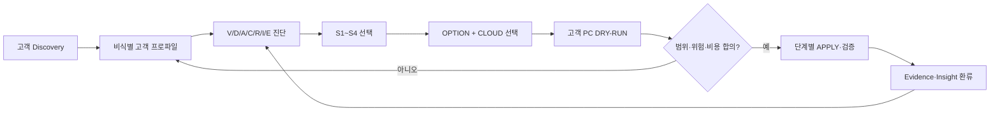
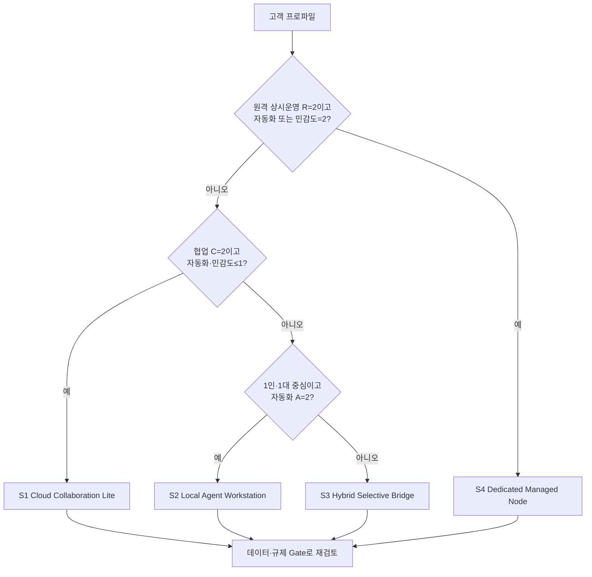
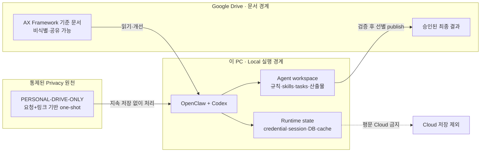

# 10인 이하 업체 AX 컨설팅을 위한 Agent 업무환경 진단·솔루션 매핑 리포트

> 고객의 업종·인원·업무 흐름·데이터 민감도·기존 IT 환경을 진단하고, Local·Cloud·Hybrid Agent 운영모델과 적용 수준을 선택하기 위한 사전 분석자료

- 작성일: 2026-08-13
- 개정: 2026-08-20 운영중 endpoint HOLD 판정보정 v3.21
- 개정 범위: Portable Skill Runtime 분리와 업무중 queue·index·task-state 변화의 rollout 인과관계 판정
- 문서 구조 개정: 2026-08-17 CEST
- 마지막 현장 검증: 2026-08-18 CEST · Mac mini local collector 및 TCEU Cloud 역할·경로 사용자 진술 반영
- 대상: 업종과 무관하게 대표 포함 10인 이하의 영세·소규모 사업자
- 초기 검증 업종 예시: 위스키 중개·무역, 소규모 수출입, 식당
- 비교안:
  1. **Local 구성** — `OpenClaw workspace = Local Obsidian Vault = OpenClaw-like Agent LLM Framework Project folder`
  2. **Cloud 구성** — `Cloud workspace for Version control = Cloud Obsidian Vault = OpenClaw-like Agent LLM Framework Project folder`; Community Sharing은 별도 공동 원천

> 이 리포트의 “Cloud Vault”는 Cloud workspace for Version control을 OneDrive 또는 Google Drive의 동기화 폴더로 두고 여러 LLM 도구의 공통 프로젝트 루트로 직접 사용하는 구성을 뜻한다. 단순 백업이나 Cloud library for Community Sharing의 읽기 전용 공동원천은 별개의 방식이다.
>
> **확정 전제:** Obsidian Sync는 사용하지 않는다. Obsidian은 동기화·자동화·memory 관리 주체가 아니라, Vault 안에 생성된 Markdown 문서와 업무 결과를 사용자가 PC에서 읽고 탐색하기 위한 local reading tool이다. Local 구성의 파일은 로컬 디스크에, Cloud 구성의 파일은 OneDrive/Google Drive desktop client에 의해 동기화된다.

> **현장 적용 범위:** 본문은 여러 LLM 도구를 비교하는 일반 프레임워크를 유지하되, 2026-08-13부터 실제 Mac mini에서 **OpenClaw와 Codex만 사용하는 2-tool 운영 사례**를 별도 추적한다. 현장 사례의 관찰값·변경 결과·실패·복구 시험은 일반론을 수정하거나 강화하는 근거로 다시 본문에 환류한다.

## 0. 문서 목적과 컨설팅 사용법

### 이 문서의 역할

이 문서는 특정 제품을 먼저 판매하기 위한 제안서가 아니다. **10인 이하 업체의 현재 업무를 진단하고, 실제로 계속 사용할 수 있을 만큼 편리한 AX 범위와 비례적인 보호수준을 매핑하기 위한 컨설턴트용 판단 기준서**다.

이 문서가 답하는 질문은 네 가지다.

1. 고객이 실제로 해결하려는 업무 병목은 무엇인가?
2. 어떤 데이터와 실행권한을 AI에 맡겨도 되는가?
3. Local, Cloud, Hybrid 중 어떤 운영모델이 고객의 인력·협업·보안 수준에 맞는가?
4. 고객이 매일 감당해야 하는 수동단계와 승인 마찰은 몇 번인가?
5. 어느 수준까지 pilot하고 무엇으로 성공을 검증할 것인가?

이 문서가 직접 하지 않는 일은 고객 PC의 설정 변경이다. 실제 진단·DRY-RUN·APPLY prompt와 검증·rollback 절차는 [고객 적용 Prompt Set Runbook](../02-Implementation/ax-customer-llm-prompt-runbook.md)을 사용한다.

### 다섯 기능 위치의 공식 명칭

| 공식 명칭 | 이 리포트에서의 의미 |
|---|---|
| **Agent Workspace for Automation** | OpenClaw와 실행형 Agent가 자동화·skills·tasks를 수행하는 작업영역. 문서 중심 업무에서는 Cloud project와 결합 가능 |
| **Cloud library for Community Sharing** | 조직 구성원이 공동 열람·편집하는 업무 원천과 공유자료 영역 |
| **Cloud workspace for Version control** | 사람의 controlled working copy 또는 Agent 변경의 candidate·검토·승인본과 변경이력을 관리하는 Cloud 작업영역 |
| **Obsidian Vault for Organization** | Markdown 지식을 사람이 정리·연결·탐색하는 열람영역 |
| **Context Workspace for Continuity** | Agent Workspace의 bootstrap·identity·memory·compound-learning·skill 골격을 따르되 실행 runtime은 제외한 portable OpenClaw-like framework |

이 명칭은 제품명보다 역할을 먼저 드러낸다. 역할 수와 물리 폴더 수는 같을 필요가 없다. 같은 root가 Version control·Vault·portable Context를 함께 수행할 수 있으며, 개인 자동화까지 쓰는 고객은 Agent Workspace 역할도 결합할 수 있다. 단, portable Context에는 OpenClaw형 지침·memory·skill만 두고 DEVICE-BOUND runtime과 제한자료는 제외한다. Provider history는 Git이나 검증된 backup과 동일하지 않다.

### 컨설팅 진행 흐름



### 빠른 문서 탐색

| 독자 | 먼저 읽을 곳 |
|---|---|
| 대표·의사결정자 | 1장 결론, 3.1 진단체계, 6.1 빠른 매핑, 12장 도입안 |
| AX 컨설턴트 | 0장, 3장, 6장, 7장, 14장, 15장 현장 사례 |
| 고객 PC의 LLM | 이 리포트의 고객 프로파일·권고안과 Prompt Set Runbook 전체 |
| 기술 구현 담당자 | 8~12장, Prompt Set Runbook의 실행 계약·검증·rollback |

## 1. 결론

### 권고안

소규모 업체의 기본안은 **사람이 매일 쓰는 문서 프로젝트는 Cloud에서 직접 열고 자동동기화하며, 실행 runtime·credential·session·DB·cache만 local에 남기는 편의성 우선 하이브리드 구성**이다. 정상 문서작업에는 별도 outbox·수동 Cloud 게시·반복 승인을 두지 않는다.

식당처럼 여러 사람이 메뉴·SOP·일정·거래처 정보를 자주 열람하는 사업은 Cloud 문서층의 비중을 높일 수 있다. 그러나 POS 원장, 급여·인사, 결제정보, 로컬 자동화 실행 상태까지 Cloud Obsidian Vault 하나에 합치는 방식은 권장하지 않는다. 자동화가 필요하면 별도의 상시 가동 PC 또는 미니 PC에서 Local 운영계를 두고 Cloud 문서층을 참조하게 하는 편이 안정적이다.

현장 적용 PC처럼 도구가 OpenClaw와 Codex로 한정되면 Claude·Antigravity용 adapter는 필요하지 않다. 대신 Context Workspace의 `skills/<name>`을 **portable definition 정본**으로 두고 Codex의 `.agents/skills/<name>/SKILL.md`에는 정본 상대경로와 runtime preflight만 적은 일반파일 loader를 둔다. `node_modules`, package cache와 Junction·symlink는 Device-Local Runtime으로 분리한다. 도구 수가 줄어도 동시 쓰기·권한·백업 문제는 사라지지 않지만, adapter 복제와 정책 불일치 면적은 크게 줄어든다.

### 한 문장 판단

- **문서 중심 업무 자동화의 기준 저장소:** 직접 여는 Cloud project workspace
- **실행 runtime의 기준 저장소:** Local workspace
- **다중 기기 열람·공유:** Cloud 문서층
- **공동 업무 원천:** Cloud library for Community Sharing
- **working copy·변경이력:** Cloud workspace for Version control
- **Markdown 열람:** Obsidian local app
- **LLM 간 업무 연속성:** 채팅 기억이 아니라 공통 파일 규약
- **원격 명령:** Telegram은 명령·승인 채널로만 사용
- **복구:** Cloud Sync와 별개인 버전 백업과 복원 시험
- **현장 지식 환류:** 적용 전후 근거를 living report의 evidence/insight ledger에 기록
- **운영 마찰:** 정상 업무 1건의 수동 인계·반복 승인 0회 목표

### 민감정보는 저장 위치가 아니라 성격으로 먼저 분리한다

이 사례에서 “민감정보”를 하나의 Cloud 금지 묶음으로 다루면 운영 목적이 충돌한다.

| 분류 | 예 | 정본 원칙 |
|---|---|---|
| `DEVICE-BOUND` | credential, session, cookie, browser profile, SQLite, lock, machine-local runtime/config/log | 이 PC의 local runtime 또는 OS credential store. 평문 Cloud 금지, 승인된 암호화 복구본만 허용 |
| `RESTRICTED-SOURCE-ONLY` | 고객·직원·가족의 개인정보, 재무·세금, 건강, 법률·규제 원문 | agent workspace 저장 금지. 현재 작업에 승인된 링크/문서 ID로 고객의 통제된 원천시스템을 one-shot 접근 |

`RESTRICTED-SOURCE-ONLY` 문서가 계정에 공유돼 있다는 사실은 background scan 권한이 아니다. 사용자 요청과 해당 링크가 같은 작업에 있어야 하며, 직접 원천시스템 API 처리를 우선한다. 포맷상 다운로드가 필요하면 workspace 밖의 제한된 OS 임시영역만 사용하고 작업 종료 후 정리한다. 원문·추출문·개인 파일명·공유 URL은 memory, task, output, Git, Community Sharing·Version control workspace·Workflow manifest에 장기 저장하지 않는다. 고객별 추가 인증 gate는 별도로 강제한다. 이 Mac mini 현장 사례에서는 이 공통 등급을 Google Drive 기반 `PERSONAL-DRIVE-ONLY`로 구체화한다.

Cloud project를 직접 여는 방식은 문서·분석·prompt·handoff에는 가장 단순하다. 문제는 Cloud 자체가 아니라 SQLite/RAG/cache/runtime까지 같은 root에 넣거나 여러 writer가 같은 파일을 동시에 수정하는 경우다. 따라서 기본안은 Cloud Direct Workspace를 유지하되 DEVICE-BOUND state 제외와 한 task·한 writer만 지킨다.

## 2. 공식 제품 동작에서 확인되는 전제

1. OpenClaw는 기본적으로 `~/.openclaw/workspace`를 workspace로 사용하고, `AGENTS.md`, `SOUL.md`, `IDENTITY.md`, `USER.md`, `MEMORY.md`, 날짜별 memory와 skills를 지속 문맥으로 사용한다. 설정·인증·세션은 workspace가 아니라 `~/.openclaw` 상태 디렉터리에 둔다. 공식 문서도 workspace를 private Git 저장소 등으로 별도 백업할 것을 권한다. ([OpenClaw FAQ](https://docs.openclaw.ai/help/faq), [Agent workspace](https://docs.openclaw.ai/concepts/agent-workspace))
2. Codex는 프로젝트 루트에서 현재 작업 디렉터리까지 `AGENTS.md`를 계층적으로 읽는다. 가까운 지침이 우선하며 기본 프로젝트 지침 합계 제한은 32 KiB이다. 따라서 전체 운영 매뉴얼을 루트 파일 하나에 무한정 넣는 대신 얇은 부트스트랩과 세부 파일로 나눠야 한다. ([OpenAI Docs — AGENTS.md](https://learn.chatgpt.com/docs/agent-configuration/agents-md))
3. Antigravity는 workspace 규칙을 `.agents/rules/`에서 읽고, 규칙 파일당 12,000자 제한이 있다. Workspace plugin은 `.agents/plugins/` 아래에 skills, rules, MCP, hooks를 묶을 수 있다. 프로젝트별 폴더 경계와 권한도 설정할 수 있다. ([Rules](https://antigravity.google/docs/ide-rules), [Projects](https://antigravity.google/docs/projects?app=cli), [Plugins](https://www.antigravity.google/docs/plugins))
4. Claude Code는 루트 `CLAUDE.md`를 세션 시작 시 자동으로 읽지만, Claude Desktop의 일반 Chat Project, Cowork Project, Claude Code는 서로 같은 저장·로딩 모델이 아니다. Cowork Project는 로컬 폴더를 context로 연결할 수 있으나 프로젝트 메타데이터는 desktop-local이고 현재 cloud sync가 없다. 따라서 Vault 안의 파일만으로 Claude Desktop 자체 memory가 자동 이식된다고 가정하면 안 된다. ([CLAUDE.md](https://support.claude.com/en/articles/14553240-give-claude-context-claude-md-and-better-prompts), [Cowork Projects](https://support.claude.com/en/articles/14116274-organize-your-tasks-with-projects-in-claude-cowork))
5. Claude의 로컬 파일 접근은 Desktop extension/local MCP 또는 Cowork 연결 폴더를 통해 이뤄진다. Anthropic은 민감 폴더 전체를 연결하지 말고 전용 작업 폴더와 백업을 사용하라고 안내한다. 로컬 파일을 연 원격 Cowork 세션에서는 해당 데이터가 Anthropic 서버에서 처리될 수 있다. ([Local connectors](https://support.claude.com/en/articles/11725091-when-to-use-desktop-and-web-connectors), [Cowork safety](https://support.claude.com/en/articles/13364135-use-claude-cowork-safely))
6. Obsidian은 Vault를 로컬 폴더로 열어 Markdown을 표시하며 외부 파일 변경도 다시 읽는다. 본 설계에서는 Obsidian Sync를 사용하지 않으므로 동기화 안정성은 Obsidian이 아니라 OneDrive/Google Drive desktop client의 local materialization과 충돌 처리에 달려 있다. Obsidian은 가급적 생성 결과를 읽는 용도로 두고, agent framework와 업무 원본의 쓰기는 LLM 도구와 승인된 자동화가 담당한다. ([Obsidian data storage](https://obsidian.md/help/data-storage))
7. OneDrive는 다른 PC에서 같은 파일을 동시에 수정하거나 오프라인 편집하면 충돌할 수 있고 symbolic link와 Junction 동기화를 지원하지 않는다. Microsoft는 여전히 최적 성능을 위해 총 동기화 항목을 300,000개 이하로 권장한다. 2026년 4월부터 조건부 1,000,000개 동기화가 Windows public preview로 제공되지만 일반 영세사업자의 기본 설계 한도로 간주하면 안 된다. 따라서 Cloud project 안의 `node_modules`·package cache 연결점은 지원대상이 아니다. ([Microsoft OneDrive 제한](https://support.microsoft.com/en-US/onedrive/restrictions-and-limitations-in-onedrive-and-sharepoint))
8. Google Drive for desktop은 Stream과 Mirror를 구분한다. Stream은 파일이 로컬에 없을 수 있고 앱 실행과 인터넷에 의존한다. Mirror는 항상 로컬 복사본을 유지하고 쓰기 많은 앱에 더 적합하다. 파일 내용이 다르면 Google Drive는 양쪽 사본을 모두 보존할 수 있다. ([Google Drive Stream/Mirror](https://support.google.com/drive/answer/13401938))
9. 네 제품은 같은 파일을 자동으로 읽는 규칙이 동일하지 않다. Codex는 `AGENTS.md`, Antigravity는 `.agents/rules/`와 `.agents/skills/`, Claude Code는 `CLAUDE.md`, OpenClaw는 루트 bootstrap 파일과 workspace skills를 사용한다. Claude Cowork의 project memory와 metadata는 로컬 제품 상태이므로 Vault 파일과 동일하지 않다. 공통 문맥은 한 곳에 정본을 두되 각 제품에 얇은 adapter를 제공해야 한다.
10. OpenClaw는 workspace의 `skills/`와 `.agents/skills/`를 발견하고 Codex는 repository 범위의 `.agents/skills/`를 발견한다. Codex 자체는 symlinked skill folder도 지원하지만 Cloud sync provider의 지원까지 보장하지 않는다. Cloud Context에서는 `skills/<name>`을 정본으로 두고 `.agents/skills/<name>/SKILL.md`가 상대경로로 정본을 읽게 하는 얇은 일반파일 loader가 기본이다. ([OpenClaw Skills](https://docs.openclaw.ai/tools/skills), [OpenAI Codex Skills](https://developers.openai.com/codex/skills/))
11. 현장 증거는 세 등급으로 나눠야 한다. 명령·파일로 확인한 값은 `observed`, 관찰값에서 도출한 판단은 `inferred`, 아직 실행하지 않은 개선안은 `proposed`로 표시한다. 이 구분이 없으면 권고가 실제 통제로 오인되고 복구 가능성도 과대평가된다.

## 3. 평가 기준

| 기준 | 중요 이유 |
|---|---|
| 자동화 안정성 | 스크립트, RAG, Office 변환, 브라우저 작업이 중간 상태 파일을 많이 생성함 |
| LLM 전환 연속성 | Codex, Antigravity, Claude, OpenClaw가 서로 다른 규칙·memory 로딩 방식을 사용함 |
| 데이터 보호 | 계약, 가격표, 고객·공급자 정보, 송장, 인사·결제 자료가 포함될 수 있음 |
| 원격 운영 | PC에서 떨어져 있을 때 Telegram을 통한 OpenClaw 실행과 승인 필요 |
| 충돌·복구 | 여러 앱과 sync client가 같은 파일을 동시에 수정할 수 있음 |
| 운영 난이도 | 전담 IT 인력이 없는 사업자가 장애를 직접 해결해야 함 |
| 사용 편의성 | 반복 승인·복사·게시가 많으면 채택률과 실제 절차 준수율이 함께 떨어짐 |
| 비용 | 구독료뿐 아니라 장애 복구 시간과 잘못된 자동화의 비용까지 포함 |
| 확장성 | 문서 수, 거래처, 직원, 자동화 종류가 늘어날 때 구조를 유지할 수 있어야 함 |

### 3.1 고객 진단체계 — 7개 축

Discovery 결과를 느낌이나 제품 선호가 아니라 동일한 축으로 비교한다. 각 축은 `0=낮음`, `1=중간`, `2=높음`으로 기록하되, 합계만으로 자동 결정하지 않는다. 데이터 민감도와 규제는 합계보다 우선하는 gate다.

| 코드 | 진단축 | 0 | 1 | 2 |
|---|---|---|---|---|
| `V` | AX 가치·반복성 | 일회성·효과 불명 | 월/주 반복 | 일/시간 단위 반복, 병목 명확 |
| `D` | 데이터 민감도 | 공개·비민감 | 내부 업무자료 | 개인정보·재무·계약·건강·규제자료 |
| `A` | 자동화 깊이 | 검색·초안 | 파일 생성·내부 갱신 | 외부 전송·브라우저·결제·운영 실행 |
| `C` | 협업·다기기 | 1인·1대 | 2~3인 또는 두 기기 | 4~10인 공동 열람·수정 |
| `R` | 원격·상시 운영 | 필요 없음 | 간헐적 원격 | 상시 gateway·예약 작업 필요 |
| `I` | IT 운영역량 | 외부지원 의존 | 매뉴얼로 운영 가능 | 내부 담당자가 log·backup·rollback 수행 |
| `E` | 기존 생태계 | 혼재·미정 | Google 또는 Microsoft 중심 | 강한 DLP·관리형 tenant·전용 업무시스템 |

### 3.2 고객 프로파일 표준 형식

상담 메모를 그대로 구현 prompt로 넘기지 말고 아래처럼 구조화한다. 모르는 값은 추정하지 않고 `unknown`으로 두며, 개인정보 원문이나 credential은 넣지 않는다.

```yaml
customer_profile:
  customer_id: "비식별 고객 코드"
  industry: "업종"
  headcount: 1-10
  locations: 1
  primary_processes: []
  top_pain_points: []
  current_tools: []
  llm_tools_available: []
  llm_runtime_capabilities:
    file_read: unknown
    file_write: unknown
    shell: unknown
    browser: unknown
  cloud_ecosystem: google | microsoft | mixed | none
  cloud_target:
    type: local-sync-folder | onedrive | sharepoint-library | google-drive | none | unknown
    path_or_url: ""
  collaboration_model:
    users: []
    devices: []
    concurrent_writers: unknown
  external_action_boundary:
    draft_only: true
    send_or_submit: false
  usability:
    priority: highest | high | balanced
    maximum_routine_manual_handoff_steps: 0
    routine_internal_edit_requires_approval: false
    direct_cloud_project_preferred: true
    accepted_isolation_triggers: []
  restricted_source_policy:
    system: sharepoint | onedrive | google-drive | industry-saas | other | none
    one_shot_link_required: true
    workspace_persistence_allowed: false
  scores:
    value_repeatability: 0-2
    data_sensitivity: 0-2
    automation_depth: 0-2
    collaboration: 0-2
    remote_operation: 0-2
    it_capability: 0-2
    ecosystem_fit: 0-2
  hard_constraints: []
  prohibited_actions: []
  approval_owner: "역할"
  approval_matrix:
    private_data_access: "역할"
    external_send: "역할"
    cloud_publish_or_share: "역할"
    system_change: "역할"
    backup_or_restore: "역할"
  pilot_sample:
    type: synthetic | anonymized | approved-real | none
    location: ""
  success_metrics: []
  stop_conditions: []
  monthly_operations_budget: ""
  unknowns: []
```

`customer_root`, Cloud target, LLM 제품형태·권한, writer/reviewer, 승인표, pilot 표본, 성공·중단 기준이 없으면 구현명령을 확정하지 않는다. 이 상태는 컨설팅 실패가 아니라 `BLOCKED_INPUT`이며, Prompt Set의 readiness gate에서 필요한 질문을 반환한다.

### 3.3 솔루션 프로파일

기존 Local/Cloud 비교는 기술 구성요소 비교이고, 컨설팅 제안은 아래 네 프로파일 중 하나로 표현한다.

| 프로파일 | 적합 조건 | 기본 구성 | 피해야 할 오해 |
|---|---|---|---|
| `S1 Cloud Collaboration Lite` | `C` 높음, `A·D` 낮음 | 문서 project를 Cloud에서 직접 편집·자동동기화, LLM 인계도 같은 폴더 | Cloud 폴더가 실행 runtime이나 backup까지 대체하지 않음 |
| `S2 Local Agent Workstation` | 1인/1대, `A` 높음, 안정 경로 중요 | Local workspace·runtime, 제한된 Cloud 입출력, 외부·파괴적 행동만 승인 | Local이라고 backup·최소권한이 자동 해결되지 않음 |
| `S3 Hybrid Selective Bridge` | 문서협업과 local 실행이 함께 존재 | Cloud Direct Workspace + Local runtime + 예외자료만 선별 bridge | 정상 문서까지 수동 publish 경계로 만들지 않음 |
| `S4 Dedicated Managed Node` | `R·A·D` 높고 업무중단 비용 큼 | 전용 host, sandbox/allowlist, encrypted backup, monitoring, 복원훈련 | 소규모 업체에도 운영책임자·유지비가 필요함 |

기본 후보는 `S3`다. 다만 `A≤1, D≤1, C=2`이면 `S1`, `A=2, C≤1, R≤1`이면 `S2`, `R=2`이면서 `A=2` 또는 `D=2`이면 `S4`를 우선 검토한다. `D=2` 자료는 어느 프로파일에서도 무차별 공유하지 않고 별도 데이터 배치정책을 적용한다.



> 이 그림은 빠른 후보 선택용이다. 최종 결정은 업종명이 아니라 7개 진단축, hard constraint, 승인자, 고객의 운영역량으로 검증한다.

## 4. 솔루션 1 — Local OpenClaw workspace 겸 Obsidian Vault

### 4.1 운영 특징

- local disk의 canonical workspace를 OpenClaw와 LLM이 직접 사용한다.
- Telegram 자동화는 같은 host·workspace에서 실행한다.
- Cloud는 선별 문서와 암호화 backup에만 쓴다.

### 4.2 장점

안정된 실파일 경로, offline 실행, SQLite·index·lock 지원, Cloud 노출 축소와 Telegram 원격 재개가 강점이다.

### 4.3 단점과 예상 문제

- backup이 없으면 PC 장애가 곧 업무중단이다.
- 전원·절전·네트워크 장애 시 원격 자동화가 멈춘다.
- 다기기 접근, WSL/Windows path adapter, 다중 Agent 권한과 Vault noise를 별도로 관리해야 한다.

### 4.4 비효율적인 부분

단일 Vault에 원문·생성물·도구별 규칙·runtime을 누적하거나 Telegram을 문서 저장소로 쓰면 검색·backup·자원운영이 악화된다.

### 4.5 적합한 활용

RAG·Office·browser 자동화, 계산·문서비교, 보고서 생성, Telegram 원격 작업처럼 안정된 local file/runtime이 필요한 업무에 적합하다.

### 4.6 개선안

디스크 암호화, credential store, 검증 backup, gateway 자동시작·kill switch, runtime/Vault 분리와 task-ID 중심 Telegram 운영을 함께 적용한다.

## 5. 솔루션 2 — Cloud workspace for Version control 겸 Obsidian Vault·프로젝트 루트

### 5.1 운영 특징

OneDrive/Google Drive의 materialized project를 LLM과 Obsidian이 함께 연다. Cloud workspace for Version control은 working copy·변경이력, Cloud library for Community Sharing은 공동 원천·배포를 맡는다. chat memory·credential·runtime은 별도다.

### 5.2 장점

다기기 접근·공유·문서 복구가 쉽고 기존 Microsoft 365/Google Workspace 생태계에서 빠르게 시작할 수 있다.

### 5.3 단점과 예상 문제

- multi-writer conflict와 online-only 지연이 발생할 수 있다.
- DB·WAL·index·`.git/`·cache·기기별 UI state는 sync와 맞지 않는다.
- vendor별 session·permission은 함께 이동하지 않으며, 회사 DLP와 AI 접근범위를 별도 확인해야 한다.
- sync는 오삭제·오염도 전파하므로 backup이 아니다.

### 5.4 비효율적인 부분

runtime·대형 binary·cache까지 Vault에 넣으면 sync preflight, conflict, pinning, 재연결과 Obsidian indexing 비용이 커진다.

### 5.5 적합한 활용

SOP·template·meeting note·결과물·knowledge base와 한 번에 한 writer가 편집하는 문서·분석·prompt·handoff 프로젝트에 적합하다.

### 5.6 Cloud Direct Workspace의 최소 조건

1. 작업파일은 local materialization하고 sync·conflict 상태를 확인한다.
2. 한 task·한 writer를 지키며 기기별 Obsidian UI state는 필요 시 제외한다.
3. DB·index·cache·log·temp·credential·`.git/`·`node_modules`와 package cache Junction·symlink는 Cloud root 밖에 둔다.
4. 중요 수정은 검증 후 원자적으로 반영하고 provider history와 별도 encrypted backup을 유지한다.
5. business account, MFA, revoke, 최소공유와 다른 PC의 필수 파일 materialization을 검증한다.

## 6. 비교 평가

점수는 5점이 가장 유리하다. Cloud 구성은 active workspace로 직접 사용하는 경우를 평가한다.

| 항목 | Local 구성 | Cloud 구성 | 판단 |
|---|---:|---:|---|
| 자동화 안정성 | 5 | 2 | 로컬 실파일과 안정 경로가 유리 |
| Telegram 원격 실행 | 5 | 2 | Cloud만으로 OpenClaw 실행 host가 생기지는 않음 |
| 다중 기기 접근 | 2 | 5 | Cloud의 대표 장점 |
| LLM 간 파일 continuity | 4 | 4 | 둘 다 adapter가 있어야 하며 cloud가 자동 해결하지 않음 |
| 동시 쓰기 충돌 내성 | 4 | 2 | Local도 다중 agent 동시 쓰기는 통제 필요 |
| PC 장애 복구 | 2 | 4 | Local은 별도 backup 전제, cloud는 sync 사본 보유 |
| 민감자료 최소 노출 | 4 | 2 | Local도 연결한 AI 서비스의 처리 범위는 별도 검토 필요 |
| 초기 설정 편의 | 3 | 5 | Cloud project 직접 열기는 별도 인계구조가 없어 가장 단순 |
| RAG/DB/대량 파일 | 5 | 1 | active DB와 cloud sync는 분리해야 함 |
| 전담 IT 없는 운영 | 3 | 4 | 문서형 Direct Workspace는 단순하나 runtime·동시 writer까지 섞으면 급격히 복잡해짐 |
| 협업·공유 | 2 | 5 | 공유 대상은 별도 Cloud 문서층으로 해결 가능 |

### 6.1 고객 상황별 빠른 매핑

| 고객 상황 | 우선 프로파일 | 적용 수준 | 첫 pilot |
|---|---|---|---|
| 대표 1인이 문서·메일·보고서를 반복 처리 | `S2` 또는 `S3` | `OPTION-1→2` | 읽기 전용 검색·초안과 표준 output 폴더 |
| 4~10인이 SOP·템플릿·최종본을 공동 열람 | `S1` 또는 `S3` | `OPTION-1 + CLOUD-1` | 비민감 문서층과 single-writer 규칙 |
| 계약·재무·개인정보가 많고 자동화도 필요 | `S3` | `OPTION-2`, 이후 제한적 `OPTION-3` | 데이터 등급 분리와 승인 기반 local workflow |
| Telegram·예약 작업·브라우저 자동화를 상시 사용 | `S4` | `OPTION-2→3` | 전용 host, backup, session 격리, 기능 회귀시험 |
| IT 담당자가 없고 업무도 아직 표준화되지 않음 | `S1`의 read-only 범위 | `OPTION-0→1` | 업무 inventory와 한 가지 반복업무만 측정 |

매핑 결과는 “제품명”이 아니라 `프로파일 + 옵션 + Cloud 모듈 + 금지행동 + 성공지표`로 기록한다. 예: `S3 / OPTION-2 / CLOUD-1 / 외부전송은 매번 승인 / 견적 작성시간 50% 단축`.

## 7. 업종별 권고

### 7.1 위스키 중개·무역

**권고: Local 운영계 80% + Cloud 문서층 20%.**

주요 자료에는 공급자 가격, 고객 조건, 수량, 마진, 독점·유통 계약, 세금·수입 관련 문서와 연락처가 포함될 수 있다. 문서 검색과 자동화 가치는 크지만, 무차별 cloud/AI 공유의 손실도 크다.

- Local: 견적 계산, 계약 비교, 거래처 history, RAG, 문서 생성, memory, task state
- Cloud: 승인된 제품 catalog, 비민감 SOP, 외부 공유용 최종본, 전달용 input/output
- 사람 확인 필수: HS code·세금·주류 수입 규제, 최종 가격, 계약 조건, 송금, 고객에게 보내는 메시지
- 좋은 자동화: landed-cost workbook, 견적 version diff, 필수 서류 checklist, supplier follow-up draft, inventory aging report
- 금지에 가까운 자동화: 무승인 발주·결제·세관 신고·가격 확정·계약 수락

### 7.2 일반 소규모 수출입 업체

**권고: 위스키 무역과 동일한 Local-first 하이브리드.**

Incoterms, 원산지, 통관, 운송서류, 환율, 납기, 공급자·고객 약속이 결합되므로 audit trail과 source provenance가 중요하다. Cloud Vault 단일계보다 task별 근거·승인·결과를 로컬 운영계에 남기고, 최종 문서만 공유하는 편이 낫다.

### 7.3 식당 운영

**권고: Cloud 문서층 60% + Local 자동화 노드 40%.**

- Cloud에 적합: 메뉴, 레시피, 청소·위생 SOP, 거래처 catalog, 직원용 공지 초안, 교육자료
- Local/전용 SaaS에 유지: POS, 결제, 급여, 근태, 고객 개인정보, CCTV, 세무 원장
- 자동화 host가 필요할 때: 사무실 미니 PC 또는 관리자 PC에서 OpenClaw를 실행하고 Cloud 문서층은 read-mostly로 참조
- 좋은 자동화: 발주 제안, 재고 임계치 알림, 메뉴 원가표, 주간 waste 요약, 리뷰 답변 초안
- 사람 확인 필수: 알레르기 정보, 식품안전 판단, 급여·징계, 환불·결제, 고객 공개 답변

### 7.4 다른 업종으로 확장하는 방법

업종명만으로 솔루션을 고정하지 않고, 핵심 업무의 데이터·자동화·협업 형태로 매핑한다.

| 업무 유형 | 업종 예시 | 우선 검토 |
|---|---|---|
| 문서·고객자료 중심 전문서비스 | 회계·세무·법률·보험·컨설팅 | `S3`, 높은 `D`, source-only 자료와 승인 gate |
| 현장·예약·사진·보고 중심 | 수리·시설·건설·부동산 | `S3` 또는 `S4`, 모바일 입력과 현장→사무실 handoff |
| 공동 SOP·콘텐츠 중심 | 소매·식당·교육·프랜차이즈 | `S1` 또는 `S3`, Cloud read-mostly와 역할별 권한 |
| 대표 1인 지식업 | 디자인·마케팅·번역·1인 무역 | `S2` 또는 `S3`, local workspace와 승인된 결과 publish |
| 규제·고민감 자료 중심 | 의료·복지·금융 보조업무 | `S3` 또는 `S4`, 외부 AI 허용정책과 데이터 gate가 선행 |

실제 매핑은 업종 예시보다 3.1의 7개 진단축과 고객별 hard constraint를 우선한다.

## 8. 권장 하이브리드 아키텍처



도식의 핵심은 Cloud를 runtime이나 workspace로 쓰는 것이 아니라, 검증된 문서의 기준본·공유 경계로 쓰는 것이다.

```text
회사 업무 PC 또는 전용 미니 PC
├── Local Agent Workspace (canonical, always-local)
│   ├── AGENTS.md                 # Codex/OpenClaw bootstrap
│   ├── CLAUDE.md                 # Claude Code용 얇은 adapter
│   ├── IDENTITY.md / SOUL.md / USER.md / MEMORY.md
│   ├── .agents/
│   │   ├── rules/                 # Antigravity adapter
│   │   ├── skills/                # portable skill instructions
│   │   ├── memory/ / tasks/
│   │   └── compound/              # 검증된 반복 교훈
│   ├── projects/
│   │   ├── whisky-trade/
│   │   ├── restaurant/
│   │   └── import-export/
│   ├── docs/                       # Obsidian으로 읽는 MD 보고서·운영문서
│   ├── scripts/ / tests/
│   └── outputs/
├── Local Runtime State (Vault 밖, sync 금지)
│   ├── credentials / cookies / auth profiles
│   ├── sessions / logs / temp / cache
│   ├── SQLite / WAL / vector indexes / local models
│   └── browser profiles
└── Cloud Document Layer (선별 동기화)
    ├── 00_Inbox
    ├── 10_Approved-Sources
    ├── 20_Shared-Templates
    ├── 30_Final-Outputs
    └── 90_Archive
```

### 핵심 설계 원칙

- **공통 정본은 하나:** 세 도구용 instruction file을 각각 독립 편집하지 않는다.
- **adapter는 얇게:** `AGENTS.md`, `CLAUDE.md`, `.agents/rules/*.md`는 공통 core를 읽는 방법과 도구별 차이만 기록한다.
- **Obsidian의 역할을 제한:** Obsidian은 `docs/`, project note와 생성된 MD 결과를 읽고 탐색한다. rules·skills·memory의 실행과 동기화를 담당하지 않는다.
- **portable memory만 공유:** 결정, 근거, task 상태, 검증 결과만 Markdown/JSON으로 남긴다.
- **Context는 portable OpenClaw-like framework:** `AGENTS/SOUL/IDENTITY/USER/MEMORY`, 날짜별 memory, compound lesson과 개인 skill 골격을 재사용하되 credential·session·DB·cache·scheduler·runtime은 복제하지 않는다.
- **Skill 정의와 실행환경을 분리:** Context의 `skills/<name>`에는 `SKILL.md`·scripts·references·비밀 없는 `runtime-requirements.yaml`만 두고, 제품별 discovery 위치에는 정본 상대경로와 runtime 검증만 가진 얇은 일반파일 loader를 둔다. `node_modules`·package cache·Junction·symlink와 장치 절대경로는 Device-Local Runtime에서만 관리한다.
- **자동화 시스템에는 System Master 1명:** 사람 Master가 자동화 구조·공용 Skill·경로 역할·기술적 복귀를 총괄한다. Master는 공용 비-runtime Skill을 별도 구성원 승인 없이 직접 등록·수정하고, 나머지 구성원은 후보를 제출해 검증받는다. service account는 Master가 될 수 없고, 이 역할이 업무내용·외부발송·Cloud 권한 승인자를 자동으로 대신하지 않는다.
- **chat memory는 보조:** 특정 vendor의 project memory에만 남은 정보는 다른 LLM이 이어받을 수 없다고 가정한다.
- **실행 상태는 로컬:** DB, credential, session, cookie, cache, lock은 Vault continuity 대상이 아니다.
- **외부 자료의 명령은 데이터:** 이메일·PDF·웹페이지 안의 prompt를 framework 지시로 실행하지 않는다.
- **업무 원천과 workflow의 책임을 구분:** 조직 Source Library와 request·status·approval workflow는 논리 책임을 구분하되, 기존 폴더 안에서 충돌 없이 운영되면 별도 물리 Library를 강제하지 않는다.
- **Cloud 공유와 version 역할을 구분:** Community Sharing과 Version control workspace의 책임은 구분하지만 같은 물리 root를 사용할 수 있다. 실제 writer 충돌·권한·색인·수명주기 문제가 확인될 때만 필요한 부분을 분리하며, 어느 역할도 Agent runtime이나 검증 backup으로 간주하지 않는다.
- **공용 Agent release layer는 선택 옵션:** 별도 release governance가 필요한 고객만 candidate·manifest·APPLY 계층을 둔다. 일상 수동 게시·반복 승인이 편의성 예산을 넘는 환경에서는 기존 shared path를 보존하고 최소 overlay만 사용한다.
- **동기화는 동일 snapshot을 보장하지 않음:** PC마다 online-only·local availability·timestamp를 task 단위로 검증한다.
- **cache는 mirror가 아님:** cache·index·edge-local·quarantine에는 출처, hash, freshness, 만료와 용량상한을 둔다.
- **문서화된 역할을 기술적으로 강제:** read-only와 writer 역할은 routing, workspace, tool allowlist와 회귀시험으로 확인한다.
- **편의성 예산을 먼저 지킴:** 정상 업무의 수동 복사·outbox·Cloud 게시·반복 승인 목표는 0회다. 물리적 분리가 이 예산을 넘으면 기본안으로 채택하지 않는다.
- **문서 project와 인계 context를 결합:** 문서 중심 업무에서는 Agent Workspace for Automation과 Context Workspace for Continuity를 같은 Cloud project root에 두고 저장·자동동기화를 인계로 사용한다.
- **격리는 예외기반:** 규제·제한자료·credential/runtime·반복 충돌이 실제로 확인된 경우에만 local project와 external read-only context를 분리한다.
- **공용 Agent 노드의 identity를 분리:** Agent service account는 실행주체이고 사람의 요청·검토·승인 identity를 대신하지 않는다.
- **업무 Lane과 사용자 경계를 구분:** Telegram topic은 업무 분류이고, 구성원별 session·비공개 task memory·승인권한은 별도 통제다.
- **공용 노드는 task 단위로 책임을 귀속:** requester, approver, acting Agent, service identity와 claim을 구분해 기록한다.
- **세 Stage 안에 내부 Gate를 둔다:** 단계 수는 단순하게 유지하되 필수결정이 미해결이면 GO를 금지하고, 구조 생성·합성시험·실제 업무·Agent 변경을 서로 다른 변경창으로 직렬화한다.

### 8.1 OpenClaw + Codex 2-tool 최적화

일반 아키텍처에서 Claude·Antigravity adapter를 제거하면 현장 PC의 최소 구조는 다음과 같다.

```text
Portable Context workspace
├── AGENTS.md / SOUL.md / USER.md / MEMORY.md
├── skills/
│   └── evolve-agent-framework-report/    # portable definition 정본
├── .agents/skills/
│   └── evolve-agent-framework-report/
│       └── SKILL.md                      # 상대경로 loader · Junction 아님
├── tasks/                                # portable handoff/evidence
├── docs/ / notes/ / projects/
├── outputs/
│   ├── draft/
│   └── final/
└── temp/                                 # ignored + retention policy

Device-Local Runtime                     # Vault·Cloud 밖
├── skill-runtimes/<skill-name>/
├── agent-runtimes/shared-node/
├── node_modules / package cache
└── runtime path adapter

~/.openclaw/                              # OpenClaw runtime
├── credentials / sessions / logs
├── SQLite / locks / delivery queues
└── browser profiles / caches
```

이 구조에서 `AGENTS.md`는 두 도구가 공유하는 작업 규칙이고, OpenClaw의 `SOUL.md`, `USER.md`, `MEMORY.md`는 OpenClaw 지속 문맥을 보완한다. Codex는 작업에 필요한 파일을 직접 읽되 OpenClaw의 세션 기억을 자동으로 승계한다고 가정하지 않는다. 업무 재개에 필요한 최소 상태는 `tasks/`의 명시적 상태 파일과 산출물 검증 기록으로 전달한다.

### 8.2 두 도구의 역할 분담

| 역할 | OpenClaw | Codex |
|---|---|---|
| 상시 실행·Telegram 제어 | 주 담당 | 비상시/직접 세션 보조 |
| cron·heartbeat·gateway | 주 담당 | 설정·코드 검토 및 구현 |
| 대화 기반 생활/업무 지원 | 주 담당 | 복잡한 로컬 작업 보조 |
| 저장소 코드·스크립트 변경 | 제한적·승인 기반 | 주 담당 |
| 장시간 진단·테스트 | 실행 가능 | 주 담당 |
| 공통 규칙 | `AGENTS.md` 등 읽기 | `AGENTS.md` 계층 읽기 |
| 공통 skill | `skills/` 정본에서 로드 | `.agents/skills/`의 얇은 loader가 같은 정본을 읽고 local runtime을 검증 |

역할 분담은 배타적 권한이 아니라 기본 ownership이다. 같은 파일을 동시에 수정할 수 있는 경우에는 한 작업의 writer를 하나로 고정하고, 다른 도구는 review 또는 verification 역할을 맡는다.

## 9. LLM 또는 실행 도구를 바꿔도 업무를 이어가기 위한 인계 규약

### 작업 시작

1. 공통 bootstrap과 user/safety 규칙을 읽는다.
2. 오늘 또는 가장 최근의 관련 memory를 읽는다.
3. 관련 `active`/`blocked` task를 읽는다.
4. source 파일과 현재 산출물의 존재·version·hash를 확인한다.
5. 이전 LLM의 결론을 사실로 가정하지 않고 검증 기준을 다시 확인한다.
6. OpenClaw와 Codex 중 이번 작업의 단일 writer를 지정하고, 다른 도구가 이미 실행 중인지 확인한다.

### 작업 종료

1. 여러 세션 작업이면 task 파일에 현재 상태, 다음 행동, blocker, 검증 기준을 기록한다.
2. 중요한 지속 결정만 memory에 승격한다.
3. 생성물 path와 검증 결과를 기록한다.
4. 임시파일·credential·원시 chat log를 portable memory에 복사하지 않는다.
5. 다음 LLM이 chat history 없이도 재개 가능한지 dry-run checklist로 확인한다.
6. 적용 작업이라면 변경 전후 증거, rollback, post-check를 living report의 현장 사례에 반영한다.

### 최소 task 상태 예시

```yaml
title: 2026-Q3 위스키 수입 견적
status: active
updated: 2026-08-13
source_of_truth:
  - projects/whisky-trade/quotes/2026-Q3/source/
next_action: 공급자별 운임 조건 확인 후 landed-cost 재계산
blocked_by: Supplier B의 insurance 조건 미회신
verification:
  - 환율 기준일 표시
  - Incoterm별 포함 비용 확인
  - 최종 발송 전 사용자 승인
writer: codex
reviewer: openclaw
evidence:
  - command: git diff --check
    result: pass
```

## 10. Telegram/OpenClaw 원격 운영안

Telegram은 **control plane**으로 사용하고 document repository로 사용하지 않는다.

Forum topic이 업무 Lane으로 자리 잡은 고객은 topic별 독립 session에서 시작하고, 필요할 때만 전담 `agentId`와 별도 workspace·memory·tool 경계를 추가한다. Agent의 성격이 Telegram에 이미 정의된 경우 그 원천을 발견·승인해 참조하고, Runbook에 또 하나의 persona 정본을 만들지 않는다. Lane은 Purpose, Non-goals, Chat budget, Handoff, Tool-risk를 계약으로 갖춘다. ([OpenClaw Parallel specialist lanes](https://docs.openclaw.ai/concepts/parallel-specialist-lanes), [Telegram topic routing](https://docs.openclaw.ai/channels/telegram))

Grok Bot의 초기 beta에서 보이는 전문 bot 온보딩, 상시 실행 컴퓨터, 진행 상태, bot 간 인계, 반복 routine은 제품 의존성 없이 옵션 패턴으로 분리해 검증한다. 기존 전용 OpenClaw PC가 있는 고객에게 별도 Cloud computer는 중복일 수 있으므로, 온보딩·Lane·상태·handoff만 선별 차용한다.

### 권장 명령 형식

```text
[업무 ID]
목표:
대상 프로젝트:
허용 작업: 읽기 / 초안 생성 / 로컬 변경 / 외부 전송
승인 필요 단계:
완료 기준:
```

### 필수 통제

- bot/group allowlist와 강한 계정 보안
- 외부 전송·결제·삭제·계약 확정은 별도 명시 승인
- Telegram에서는 credential이나 전체 고객 명단을 보내지 않음
- host PC는 disk encryption, screen lock, OS update, 제한된 업무 계정 사용
- gateway 자동 시작과 상태 점검
- PC가 꺼진 경우를 “실패”와 구분해 `HOST_OFFLINE`으로 보고
- 모든 외부 행동은 대상·초안·승인·실행·사후 검증을 분리
- 원격 차단을 위한 gateway stop 절차와 계정 revoke 절차 문서화

OpenClaw 공식 문서도 workspace가 hard sandbox가 아니며 absolute path로 host의 다른 위치에 접근할 수 있다고 경고한다. 따라서 workspace를 지정하는 것만으로 충분한 보안 경계가 되지 않으며 sandbox와 OS 권한 제한을 함께 사용해야 한다. ([OpenClaw Agent workspace](https://docs.openclaw.ai/concepts/agent-workspace))

## 11. 백업 및 복구

### Cloud Sync와 backup을 구분

- Sync: 최신 상태를 여러 위치에 복제하며 잘못된 삭제도 전파할 수 있음
- Version history: 단기 실수 복구에 유용하지만 보존 기간·정책 의존
- Backup: 독립된 시점 사본으로 원본 오염과 분리되어야 함

### 권장 최소 정책

- Local workspace: 매일 versioned incremental backup
- OpenClaw 전체 복구본: `openclaw backup create --verify`를 이용해 config, auth profile, channel credential, session과 선택적 workspace가 포함된 로컬 archive를 생성하고 별도 암호화 보관소로 이동. archive 자체가 고감도 자산이므로 평문 cloud 업로드를 금지하고 접근권한·보존기간·폐기 절차를 둔다. workspace Git backup만으로 session/auth가 복구된다고 가정하지 않는다. ([OpenClaw backup](https://docs.openclaw.ai/cli/backup))
- Agent framework의 Markdown/scripts: private Git remote 또는 암호화 archive
- 고객·계약·재무 자료: 업무용 cloud tenant의 별도 권한 폴더
- 월 1회 offline 또는 별도 계정 사본
- 분기 1회 restore test
- browser cookie와 임시 browser profile은 기본 복구본에서 제외하고 재인증 절차를 문서화한다. OpenClaw 공식 backup에 포함되는 credential/session은 암호화된 고감도 복구본으로 별도 취급한다.

### 복구 준비도를 판단하는 네 단계

1. **Configured:** backup 명령이나 목적지가 설정돼 있다.
2. **Created:** 최신 archive 또는 snapshot이 실제로 존재한다.
3. **Verified:** manifest/hash 검증을 통과했다.
4. **Restored:** 격리된 위치에서 필요한 구성과 파일을 복원해 본 적이 있다.

Git remote, cloud sync, Time Machine 설정 중 하나가 존재한다는 이유만으로 4단계 복구 준비가 완료됐다고 평가하지 않는다. 특히 uncommitted/untracked 파일은 remote Git이 보호하지 않는다.

## 12. 단계별 도입안

아래 4단계는 일반 고객의 기능 성숙도다. 다만 **현재 업무에 사용 중인 여러 PC를 함께 변경하는 현장**에서는 기능 단계를 그대로 일괄 적용하지 않는다. 먼저 `무변경 기준선 → 기존 업무와 병행하는 Shadow Pilot → 저위험 업무 Production Canary`의 3단계 rollout으로 각 기능 변경을 감싼다. 모든 대상 PC가 같은 checkpoint를 통과해야 하며, 한쪽 미검증·실패를 다른 쪽의 성공으로 상쇄하는 부분 GO를 금지한다. 기존 업무경로는 canary 종료와 복귀시험 완료까지 유지하고, 다른 기기·업무·자동화 확대는 별도 변경요청으로 처리한다.

### 1단계 — 2주: 읽기 전용 pilot

- Local workspace와 공통 framework 파일 구성
- 기존 자료의 사본만 넣고 검색·요약·보고서 초안 자동화
- 외부 전송과 원본 수정 금지
- 실제 절약 시간과 오류 유형 기록

### 2단계 — 2~4주: 제한된 파일 쓰기

- `outputs/`에만 결과 생성
- 문서별 검증 checklist와 사용자 승인 추가
- 운영에 실제 사용하는 도구로 같은 task 상태를 재개해 portability를 시험한다. 현장 PC에서는 OpenClaw가 남긴 task를 Codex가 재개하고, Codex가 남긴 task를 OpenClaw가 읽어 설명·검증하는 양방향 시험을 한다.
- 한글 파일명, Office 잠금, sync conflict, 긴 경로 시험

### 3단계 — 원격 명령

- Telegram allowlist와 읽기 전용 명령부터 시작
- 초안 생성·상태 조회를 먼저 허용
- 외부 메시지·업로드는 매번 승인
- gateway 장애·PC 절전·network 단절 복구 시험

### 4단계 — 운영 자동화

- 가치가 검증된 반복 업무만 schedule/heartbeat로 전환
- 자동화마다 owner, input, output, timeout, retry, approval, rollback 정의
- 분기별 memory 정리, skill 검증, restore test 수행

## 13. 최종 선택 가이드

### Local 구성을 선택할 조건

- Telegram/OpenClaw로 PC 업무를 원격 수행하려는 경우
- RAG, SQLite, Office 변환, browser automation, scripts가 많은 경우
- 계약·가격·고객자료 등 민감정보가 많은 경우
- 주 사용자와 실행 PC가 사실상 한 명/한 대인 경우

### Cloud 구성을 선택할 조건

- 업무가 대부분 Markdown·PDF 열람과 단순 문서 편집인 경우
- 여러 기기·여러 직원의 공유가 자동화 안정성보다 중요한 경우
- active DB/RAG/runtime state를 Vault 밖으로 완전히 분리할 수 있는 경우
- single-writer와 conflict 처리 절차를 운영할 수 있는 경우

### 본 리포트의 최종 권고

두 안 중 하나를 일률적으로 고르지 않는다. 문서 중심 업무의 실무 기본안은 아래와 같다.

> **Cloud project를 사람이 쓰는 문서·문맥·산출물의 직접 작업공간으로 두고, 저장과 자동동기화를 LLM 인계로 사용한다. 실행 runtime과 DEVICE-BOUND state만 Local에 둔다.**

이 구조는 별도 게시절차 없이 여러 LLM과 사람이 같은 project를 이어 쓸 수 있어 소규모 조직의 채택성이 높다. 위스키 중개·무역의 제한자료, POS·인사·결제, 공용 OpenClaw runtime은 계속 분리한다. LLM 전환 연속성은 같은 Cloud project, 공통 파일 규약, 얇은 도구별 adapter와 짧은 handoff 기록에서 나온다.

## 14. 도입 전 사업자가 결정할 항목

1. 회사 보안정책상 허용되는 AI 서비스와 cloud provider
2. 각 vendor가 처리해도 되는 데이터 등급
3. 24시간 OpenClaw host를 회사 PC로 할지 전용 미니 PC로 할지
4. OneDrive 또는 Google Drive 중 기존 업무 tenant와 맞는 provider
5. 외부 전송·주문·결제·계약에 필요한 사람 승인 단계
6. backup 보존기간과 restore 책임자
7. 직원별 읽기·쓰기 범위와 퇴사/분실 시 revoke 절차
8. Obsidian Vault에서 제외할 runtime·credential·개인정보 범위

### 14.1 Discovery 인터뷰 최소 질문

1. 지난 4주 동안 가장 반복적으로 시간을 쓴 업무 세 가지는 무엇인가?
2. 각 업무의 입력·처리·출력·최종 승인자는 누구인가?
3. 오류가 나면 금전·법률·고객관계·업무중단에 어떤 영향이 있는가?
4. 개인정보, 계약, 재무, 건강, credential 중 어떤 등급이 포함되는가?
5. 누가 어느 기기에서 문서를 읽고 수정해야 하는가?
6. 현재 Google Workspace, Microsoft 365, 로컬 NAS, 업종 SaaS 중 무엇이 정본인가?
7. Codex·Claude·Antigravity·OpenClaw 등 현재 사용 가능하거나 금지된 LLM은 무엇인가?
8. 자동화가 외부 메시지·브라우저 입력·예약·결제까지 해야 하는가?
9. PC가 꺼지거나 담당자가 부재할 때도 실행돼야 하는가?
10. backup, 계정관리, 장애대응을 맡을 사람과 허용 가능한 월 유지시간은 얼마인가?
11. 2~4주 pilot이 성공했다고 판단할 수치와 중단 조건은 무엇인가?
12. 절대로 AI가 해서는 안 되는 행동은 무엇인가?
13. 정상 업무 한 건에서 허용할 수 있는 별도 승인·복사·수동 게시 횟수는 몇 번인가?

### 14.2 사전 분석 산출물

Discovery가 끝나면 최소 다음 다섯 항목을 고객에게 제시한다.

| 산출물 | 내용 |
|---|---|
| 현행 업무지도 | 입력→처리→검토→출력과 사람 승인 지점 |
| 고객 프로파일 | 7개 진단축 점수, 사용 편의성·수동단계 예산, hard constraint, unknown |
| 솔루션 매핑 | `S1~S4 + OPTION + Cloud 모듈`과 선택 근거 |
| Pilot 제안 | 한정된 use case, 2~4주 범위, 성공·중단 지표 |
| 적용·복구 계획 | 고객 PC LLM용 Prompt Set, DRY-RUN 결과, 승인 gate, rollback |

컨설팅 품질은 설치한 AI 도구 수가 아니라, 고객의 병목이 측정 가능하게 줄고 오류·정보노출·운영부담이 허용범위 안에 있는지로 평가한다.

## 15. 현장 적용 사례 — OpenClaw + Codex 전용 Mac mini

### 15.1 사례 범위와 목표

이 사례는 한 명의 주 사용자가 Mac mini 한 대에서 OpenClaw와 Codex만 사용하는 구성이다.

- OpenClaw: 상시 Gateway, Telegram control plane, cron/heartbeat, 생활·업무 assistant
- Codex: 저장소 중심 구현, 진단, 테스트, 구조 변경, 장시간 로컬 작업
- Obsidian: local workspace의 Markdown을 읽고 탐색하는 UI
- Google Drive: 입력 자료와 승인된 결과물의 선별 전달 계층
- 제외: Claude, Antigravity, Obsidian Sync 기반 active workspace

목표는 도구를 많이 연결하는 것이 아니라, **하나의 로컬 정본을 두 도구가 예측 가능하게 읽고 안전하게 인계하며, 적용 결과가 다시 운영 지식으로 축적되는 구조**를 만드는 것이다.

컨설팅 프로파일로 표현하면 이 사례는 `S3 Hybrid Selective Bridge`에서 시작해, 상시 원격 자동화의 안정성이 검증되면 일부 통제만 `S4 Dedicated Managed Node` 수준으로 강화하는 유형이다.

| 진단축 | 현장 판정 | 근거 |
|---|---:|---|
| `V` 가치·반복성 | 2 | cron·Telegram·문서·브라우저 반복업무가 존재 |
| `D` 데이터 민감도 | 2 | PC 종속 비밀과 사용자·가족 Privacy를 분리해야 함 |
| `A` 자동화 깊이 | 2 | 파일·브라우저·원격 명령·예약 작업 포함 |
| `C` 협업·다기기 | 1 | 주 사용자는 1인이지만 OpenClaw와 Codex가 인계 |
| `R` 원격·상시 운영 | 2 | Gateway·Telegram·cron 상시 운영 |
| `I` IT 운영역량 | 1 | 로컬 구현 가능하나 backup·restore·보안운영 보완 필요 |
| `E` 기존 생태계 | 1 | Google Drive 중심 문서층과 local workspace 병행 |

권고 매핑: `S3 / OPTION-2를 목표로 단계 도입 / CLOUD-1은 비민감 문서층만 / PERSONAL-DRIVE-ONLY 별도 gate`. 이 표는 제품 조합이 아니라 고객 진단축이 솔루션 선택으로 연결되는 예시다.

### 15.2 2026-08-18 관찰 스냅샷

다음 항목은 이 PC에서 명령과 설정 파일로 확인한 `observed` 값이다. 비밀값과 개인 문서명은 기록하지 않았다.

| 영역 | 관찰값 | 평가 |
|---|---|---|
| canonical workspace | `/Users/coolbot_macmini/.openclaw/workspace` | Local-first 충족 |
| OpenClaw | `2026.7.1-2`, Gateway/Node LaunchAgent 실행 | 상시 운영 기반 충족 |
| Gateway | local mode, loopback bind | 외부 직접 노출 낮음 |
| 전원 | AC sleep `0`, 자동 재시작 활성 | 원격 운영에 적합 |
| 디스크 보호 | FileVault On | 저장장치 분실 방어 양호 |
| Obsidian | local workspace를 Vault로 열고 있음 | reading layer 충족 |
| Obsidian Sync | core-plugin toggle `true` | 사용 전제와 불일치 가능; 활성 sync 자체는 미확인 |
| runtime 분리 | DB·session·credential·log·browser profile은 주로 `~/.openclaw` | 대체로 양호 |
| Vault 내부 runtime/noise | `temp/` 약 528 MB, `node_modules/` 약 96 MB, `state/` 및 workspace-state 존재 | 부분 개선 필요 |
| Markdown | 약 753개, `memory/` 236개, 시간형 session summary 159개 | 검색·기억 품질 저하 가능 |
| Time Machine | 목적지 없음 | 높은 복구 위험 |
| OpenClaw backup | 최신 verified full recovery set 미확인 | 높은 복구 위험 |
| Git | remote와 branch는 동기였으나 tracked 변경 17개·untracked 28개 | 최신 작업은 remote 미보호 |
| security audit | 0 critical, 5 warnings | hardening 필요 |
| portable handoff | 표준 `tasks/`, `outputs/` 없음 | OpenClaw↔Codex 인계 미완성 |
| OpenClaw Agent routing | `main` Agent 1개, binding 0개, Telegram topic `agentId` 없음 | topic session은 분리되지만 workspace·memory·tool 경계는 공유 |
| TCEU Microsoft Cloud | 현 문서 작성 PC에 OneDrive·SharePoint sync root 미관찰 | TCEU 두 PC에서 별도 baseline 필요 |
| privacy/Drive reconcile | sensitive registry 1개 활성, scheduled registry crawl과 workspace `temp/` metadata output 유지, security-question flag의 실행 코드 강제 gate 없음 | 새 `PERSONAL-DRIVE-ONLY` 원칙과 불일치; runtime 보완 필요 |

### 15.3 보안 감사 해석

경고를 같은 심각도로 취급하지 않고 실제 노출 조건과 결합해 해석한다.

| 경고 | 현장 해석 | 우선 조치 |
|---|---|---|
| `channels.telegram.dm.scope_main_multiuser` | 여러 DM 발신자가 main session을 공유하면 문맥 누출 가능 | `per-channel-peer` 적용 후 회귀시험 |
| `security.trust_model.multi_user_heuristic` | Telegram group + sandbox off + 강한 파일/exec 권한의 결합 위험 | 별도 테스트 agent에서 sandbox/workspaceOnly 검증 |
| `gateway.nodes.allow_commands_dangerous` | `screen.record`는 회의 녹화 use case와 충돌 가능 | 제거보다 허용 주체·토픽·승인 범위 축소 |
| `plugins.installs_unpinned_npm_specs` | Codex plugin update가 재현성을 흔들 수 있음 | 현재 검증 버전으로 pin |
| `gateway.trusted_proxies_missing` | loopback-only 상태에서는 조건부 경고 | reverse proxy 도입 전까지 현 상태 유지 |

이 사례는 “경고 수를 0으로 만드는 것”보다 **필요 기능을 유지하면서 실제 공격면을 줄이고, 변경 후 자동화 회귀시험을 통과시키는 것**을 보안 완료 조건으로 삼는다.

### 15.4 적용 상태

| 통제 | 상태 | 근거/다음 검증 |
|---|---|---|
| Local canonical workspace | implemented | OpenClaw configured workspace와 realpath 일치 |
| Runtime/Vault 기본 분리 | partial | 핵심 runtime은 밖에 있으나 `temp/`, state 정리 필요 |
| FileVault | implemented | `fdesetup status` |
| Gateway 자동 시작·loopback | implemented | LaunchAgent와 config 확인 |
| OpenClaw+Codex 공통 report-evolution skill | implemented | OpenClaw `skills info/check` 성공, fresh Codex agent의 Available Skills 노출·실행 확인 |
| 고객 적용 Prompt Set & 현장 옵션 Runbook | implemented | `PROMPT-00~80`, `OPTION-0~3`, `CLOUD-0~2`와 skill 연결 |
| Time Machine | proposed | 목적지 연결 후 snapshot/restore 확인 필요 |
| Verified OpenClaw backup | proposed | 암호화 archive 생성·verify·restore 필요 |
| Telegram DM session isolation | proposed | 설정 후 사용자별 session key 확인 필요 |
| Sandbox/workspaceOnly | proposed | Drive·브라우저·회의 recorder 회귀시험 필요 |
| Obsidian Sync 비활성화 | proposed | UI 비활성화 후 core-plugin 설정 재확인 |
| Vault temp/memory 정리 | proposed | privacy scan, backup, recoverable cleanup 순서 |
| Portable tasks/outputs | proposed | 양방향 handoff dry-run 필요 |
| Selective Google Drive bridge | proposed | `CoolFam-Agent-Library`, `CLOUD-1` 수동 선별 방식 권장; materialization/hash/approval 시험 필요 |
| Privacy link-only Drive access | partial/policy-only | 원칙과 기존 Drive 도구는 있으나 registry-wide crawl·workspace metadata output·실행 코드의 security gate가 남음 |

### 15.5 이 PC의 권장 적용 순서

1. **P0 — Privacy link-only 전환:** privacy registry의 scheduled crawl 제외, one-shot link gate, workspace 밖 임시 처리, 실행 코드의 security-question 강제
2. **P0 — 기존 privacy 잔존물 정리 계획:** Drive 정본 확인 후 workspace의 원문·추출문·지속 문맥을 비식별화하고 복구 가능한 정리안 승인
3. **P0 — 복구 기반:** Time Machine 목적지, encrypted OpenClaw backup, manifest verification, restore rehearsal
4. **P0 — Git 보호 공백 해소:** 민감·runtime 파일 분류 후 의도된 변경만 commit/push
5. **P1 — 문맥 격리:** Telegram DM scope 분리
6. **P1 — 최소권한 pilot:** 별도 agent에서 sandbox/workspaceOnly와 주요 자동화 회귀시험
7. **P1 — Vault hygiene:** Obsidian Sync 비활성화 확인, `temp/`·session summary·state 분류
8. **P2 — portable handoff:** `tasks/active`, `tasks/completed`, `outputs/draft`, `outputs/final` 도입
9. **P2 — selective cloud bridge:** 비민감 input/approved/final/archive 계층과 hash manifest 도입

각 단계는 `pre-check → 변경 → post-check → rollback 가능성 → report 환류`가 완료돼야 implemented로 승격한다.

### 15.6 Implementation evidence log

| 날짜 | 변경/점검 | before | after/evidence | rollback | 상태 |
|---|---|---|---|---|---|
| 2026-08-13 | 초기 audit·skill·Prompt Set | 현장 상태와 갱신 방식 미분류 | local/runtime·backup·Git·보안 baseline, shared skill, OPTION/CLOUD/PROMPT 체계 확인 | 문서·skill diff 역적용 | complete |
| 2026-08-13 | Cloud·Privacy 분류 | Cloud 금지 범주와 이전범위 불명확 | `DEVICE-BOUND`, `PERSONAL-DRIVE-ONLY`, selective Cloud 제안 | 해당 없음(read-only) | policy complete; runtime gap open |
| 2026-08-15 | Cloud 기준본·Specialist Lane | 문서 분산, Telegram 역할 계약 미정 | Cloud canonical package, `LANE-0~3`, Grok 패턴 추가 | 문서 diff 역적용 | documentation complete; pilot pending |
| 2026-08-17 | TCEU baseline·공용노드·3단계 | 두 PC와 5인 공용 사용 경계 미검증 | materialization/cache evidence, identity 분리, baseline→shadow→canary 설계 | 해당 없음(read-only) | field pilot pending |
| 2026-08-18 | TCEU Cloud 역할·Agent release | 공유·version·runtime 책임 혼재 | endpoint-neutral 역할, release workspace, 고정 표본·직렬 canary | 문서 diff 역적용 | location/ACL·pilot pending |
| 2026-08-18 | Mac mini evidence refresh | 전일 상태 | OpenClaw 2026.7.1-2, loopback, security 0/5, Time Machine 없음, Git 17/28 | 해당 없음(read-only) | complete |
| 2026-08-18 | 편의성 우선 교정 | 분리·outbox가 기본안 | Direct Workspace, 저장=인계, 일상 수동단계 0 | 문서 diff 역적용 | documentation complete; `EXP-016` pending |
| 2026-08-19 | 의미 기반 Prune | 리포트·Runbook·skill에 설명 중복 | 문서별 정본 역할을 고정하고 중복 절차를 링크·계약으로 압축 | 문서 diff 역적용 | complete; runtime changes 0 |
| 2026-08-19 | TCEU workspace cardinality 교정 | 공용 Agent release workspace와 구성원 PC의 Automation 역할이 남아 있었음 | Agent Workspace·Community Sharing은 각 1개, 구성원별 Version·Vault·Context 각 1개, skill 3종 배치로 교체 | 문서 diff 역적용 | documentation complete; field validation pending |
| 2026-08-19 | TCEU in-place 최적화 교정 | 고정 신규 폴더트리와 개인 역할별 분리로 읽힐 여지 | 기존 Community Sharing·개인 결합 root를 기본 유지하고 OpenClaw dependency가 확인된 부분만 최소 최적화 | 문서 diff 역적용 | documentation complete; Stage 1 audit pending |
| 2026-08-20 | TCEU portable continuity·Prune | 개인 Context가 단순 인계영역으로 표현되고 Runbook 뒤쪽에 반복 설명 존재 | OpenClaw-like portable core·`Business` 역할명·runtime 제외를 반영하고 TCEU Runbook을 15% 이상 압축 | 문서 diff 역적용 | documentation complete; `EXP-019` pending |

### 15.7 TCEU 구성원 업무 PC + 공용 OpenClaw PC 현장사례 · baseline observed

TCEU 사례는 구성원들의 업무 PC와 `tceu.manager` Agent 전용 Microsoft 365 계정으로 동작하는 공용 OpenClaw PC를 TCEU 소유의 제한된 문서영역으로 연결하는 별도 기업 현장사례다. OpenClaw PC는 특정 개인의 전용 장비가 아니라 사용자 포함 5명의 구성원이 공동 사용하는 Agent 노드다. 대상 PC를 포함한 TCEU PC가 모두 실제 업무에 사용 중이라는 전제도 사용자 진술로 확인했다. 다른 고객의 시스템·자료·자동화와 연결하지 않는다.

| 영역 | 확인된 상태 | 권고 역할 |
|---|---|---|
| TCEU 구성원 업무 PC | 같은 개인 OneDrive 폴더가 Version·Vault·portable OpenClaw-like Context 세 역할을 수행하며, 한 Node 의존 Skill 아래의 `node_modules` Junction이 반복 OneDrive sync 오류를 일으킨 사실이 endpoint Codex 결과로 보고됨 | 결합 root는 유지하되 portable Skill definition·일반파일 loader만 Cloud에 두고 Node runtime·package cache·연결점은 local로 부분 분리 |
| 공용 OpenClaw PC | Windows Node+WSL Gateway, 두 Agent·binding 없음·공유 workspace, 대형 cache/output/quarantine 혼재; 5인 공동사용은 user-reported | 조직 전체의 유일한 Agent Workspace for Automation으로 local 실행, 구성원별 session·task 귀속, read-only/writer Lane 분리 |
| `tceu.manager` | Agent 전용 Microsoft 계정이라는 user-reported 전제 | service identity로만 사용하고 human requester·approver와 분리 |
| Cloud library for Community Sharing | 조직 전체 1개의 현재 공용폴더를 최대한 활용한다는 user-defined target; OpenClaw 하위경로 의존성은 미확인 | active/reference 경로 보존, human-only 선택 정리, unknown 무변경, gap에만 최소 overlay |
| Cloud workspace for Version control | 구성원별 개인 OneDrive 결합 root가 Version·Vault·Context 세 역할을 함께 수행 | 별도 역할 root를 만들지 않고 provider history·Vault·LLM 인계를 같은 위치에서 사용 |
| Skill 저장 | OpenClaw runtime·공용 비-runtime·개인 Skill의 정본 경계와 TCEU System Master=조승현이 user-defined; catalog·discovery·후보절차는 proposed | Agent Workspace / 기존 Community Sharing의 `Shared-Skills` 역할 / 작성자 Context에 한 정본씩 둠; Master는 직접 등록, 다른 구성원은 candidate 제출 후 Master 검증 |
| 업무 연속성 | 모든 TCEU PC가 실제 업무용이라는 user-reported 전제, 허용 중단시간·업무 회귀기준은 미확인 | audit된 두 PC를 3단계 동시 Gate로 적용하고 기존 업무경로 유지 |
| 지식 환류 | TCEU Runbook 17장에 System Master가 두 PC의 비식별 Gate 결과와 현재 상태를 갱신 | 검증된 비식별 통찰만 공통문서로 승격 |

- 적용 기준: [TCEU 구성원 업무 PC와 공용 OpenClaw PC 연계 Runbook](https://drive.google.com/file/d/1BewvqzpXnE2ef66GRJ-XS7OlErtKUmRw/view?usp=drive_link)
- 현장 기록: [TCEU Runbook 17장](https://drive.google.com/file/d/1BewvqzpXnE2ef66GRJ-XS7OlErtKUmRw/view?usp=drive_link)
- 현재 상태: 로컬 폴더·동기화 snapshot·OpenClaw runtime은 `observed`; 구성원 업무 PC의 Node Skill Junction과 sync 문제는 `observed — endpoint Codex reported`; Portable Definition·Device-Local Runtime 전환은 `proposed`; 5인 공동사용, Agent 전용 계정과 모든 PC의 실제 업무 사용은 `observed — user-reported`; 구성원별 접속방식·identity·session·권한, Microsoft 365 owner·ACL·정본·회사정책과 pilot 결과는 `unknown/proposed`

권고 매핑은 문서업무 `S3 Hybrid Selective Bridge`와 공용 Agent 노드 `S4 Dedicated Managed Node`의 혼합형이다. 공용폴더와 개인 결합 workspace를 먼저 보존하며, 역할 구분은 문서·writer 계약으로 해결한다. 물리분리는 실제 문제를 해결할 때만 선택하고 정상 저장·동기화에는 승인이나 수동 publish를 추가하지 않는다.

공용 노드는 `tceu.manager` service identity와 사람의 requester·approver를 구분하고, Telegram topic을 업무 Lane으로만 사용한다. 적용은 `Stage 1 baseline → Stage 2 shadow → Stage 3 canary`의 두 PC 동시 Gate를 따른다. 세부 folder tree, identity schema, 검증 표본과 rollback은 위 TCEU Runbook을 단일 기준으로 사용한다.

## 16. 적용 지식 환류 체계

### 16.1 Evidence → Insight → Policy 흐름

```text
현장 관찰
  → 증거 명령/파일과 날짜 기록
  → 이 PC에 미치는 영향 해석
  → 다른 소규모 사업 환경에도 적용 가능한 통찰 추출
  → 일반 본문의 원칙·비교표·도입안 수정
  → 다음 적용에서 재검증
```

현장 사례는 단순 설치 일지가 아니다. 한 번의 관찰이 일반 권고를 바꿀 정도인지 검토하고, 재현 가능한 경우에만 일반 본문으로 승격한다. PC 고유 경로·일시적 버전·개인 설정은 사례에 남기고, 반복 가능한 판단 규칙만 일반론으로 올린다.

### 16.2 Insight ledger

| 날짜 | evidence | 현장 영향 | 재사용 가능한 통찰 | action/status | verification |
|---|---|---|---|---|---|
| 2026-08-13 | workspace는 local이나 Time Machine 목적지 없음 | 구조는 안정적이어도 장애 복구 취약 | 저장 위치 설계와 복구 준비도는 별도 축이다 | backup proposed | verified archive + restore test |
| 2026-08-13 | Git remote 동기, local 변경 43개 경로 | 최신 변경은 remote에 없음 | remote 존재는 uncommitted work의 backup이 아니다 | triage proposed | clean/intentional status + remote check |
| 2026-08-13 | 핵심 runtime은 밖, `temp/` 509 MB는 Vault 안 | privacy/index/backup noise | runtime 분리는 이분법이 아니라 잔여 state까지 보는 연속적 통제다 | cleanup proposed | size/index/privacy rescan |
| 2026-08-13 | Obsidian Sync toggle `true` | 설계 전제와 설정이 어긋날 수 있음 | UI toggle은 서비스 활성·정상동작의 증거가 아니다 | disable proposed | plugin config + network/activity check |
| 2026-08-13 | OpenClaw와 Codex만 사용 | 불필요한 adapter가 오히려 drift를 늘림 | 실제 도구 수에 맞춰 adapter surface를 최소화해야 한다 | architecture updated | both tools discover same skill |
| 2026-08-13 | OpenClaw `skills/`, Codex `.agents/skills` 지원 | skill 중복 없이 공유 가능 | tool별 discovery adapter와 skill 정본을 분리하면 정책 drift를 줄인다 | implemented | OpenClaw info/check + fresh Codex skill catalog/실행 |
| 2026-08-13 | sandbox off 경고와 browser/Drive 자동화 공존 | 즉시 강제 시 기능 중단 가능 | 보안 통제는 real workflow 회귀시험까지 통과해야 implemented다 | pilot proposed | scoped functional test matrix |
| 2026-08-13 | 고객 진단 리포트와 고객 PC 실행 Prompt Set을 분리·연결 | 의사결정자와 실행 LLM이 각자 필요한 깊이로 읽을 수 있음 | 컨설팅 rationale·고객 프로파일·solution mapping은 분석 리포트에, 재사용 prompt·검증·rollback은 Runbook에 두고 skill이 함께 갱신하면 제안과 구현의 추적성이 높아진다 | implemented | S1~S4→PROMPT sequence forward-test |
| 2026-08-13 | workspace 전체 이전 대신 문서층 후보를 분류 | OpenClaw local 경로를 유지하면서 Cloud 활용 가능 | Cloud 연속성은 symlink/양방향 sync보다 local staging·allowlist publish·hash manifest로 설계해야 안정적이다 | proposed | CLOUD-1 manual pilot |
| 2026-08-13 | privacy registry의 활성 폴더를 cron이 순회하고 파일명·링크 metadata를 workspace temp에 기록 | 공유 문서 원문을 복제하지 않아도 metadata와 추출 결과가 local privacy footprint를 만든다 | Privacy 문서는 “Cloud 금지”가 아니라 “요청+링크 기반 Drive 전용”으로 분류하고, background discovery와 durable local evidence를 분리해야 한다 | policy updated; runtime remediation proposed | privacy folders disabled for cron + link-only test + workspace residue scan |
| 2026-08-15 | 컨설팅 리포트와 실행 Runbook의 원본이 서로 다른 위치에 있었음 | 수정 순서와 최신본 식별이 사람·LLM 모두에게 불명확 | 외부 공유 지식은 하나의 Cloud 패키지에 기준본을 모으고, 로컬 실행 경로에는 검증된 단방향 사본만 두어야 drift를 줄일 수 있다 | Cloud canonical + local Runbook mirror implemented | Cloud/local hash 일치와 skill validation |
| 2026-08-15 | Telegram topic은 여러 업무로 나뉘었지만 OpenClaw은 단일 `main` Agent를 사용 | topic session 분리만으로는 memory·workspace·tool 최소권한이 분리되지 않음 | 기존 업무 역할이 명확한 고객은 persona를 재작성하지 말고 승인된 원천 참조 + lane contract + topic routing으로 실행 경계를 나눈다 | `LANE-1/2` proposed | 3-topic routing·memory·skill regression pilot |
| 2026-08-15 | 초기 Grok Bot이 전문 bot·상시 computer·상태·handoff·routine을 하나의 UX로 제시 | 현 TCEU는 전용 OpenClaw PC와 Telegram 토픽을 이미 보유 | 신규 제품 도입 전에 기존 인프라로 사용 패턴만 대응 구현하면 중복 비용과 데이터 이동을 줄일 수 있다 | `GROK-PATTERN-1~3` documented, unvalidated | staged pilot + user correction/time metrics |
| 2026-08-17 | 같은 조직 공유 원천의 파일수·가용성이 두 PC에서 달랐음 | 동기화 폴더 이름이 같아도 task 입력의 완전성·최신성이 달라질 수 있음 | 다중 PC 고객은 장치별 snapshot·materialization preflight를 독립 수행해야 한다 | common Prompt Set updated; pilot pending | 승인 표본 timestamp·size·hash 비교 |
| 2026-08-17 | 원천 후보에는 queue/control 구조가 없고 대부분 online-only | 전체 원천을 자동화 queue로 쓰면 bulk download·부분읽기·원천변경 위험 | Source와 Workflow의 owner·writer·retention 책임을 논리적으로 구분하되 기존 조직 공유영역을 우선 재사용한다 | v3.15에서 물리 Library 강제안을 supersede | OpenClaw dependency map 후 최소 overlay 필요성 확인 |
| 2026-08-17 | cache에 exact·changed·local-only·source-only 상태가 공존 | cache 검색이 stale 원문을 최신본처럼 보일 수 있음 | cache는 mirror가 아니라 provenance·freshness·expiry가 있는 파생물이다 | manifest contract proposed | 승인 표본 reconciliation·hash |
| 2026-08-17 | skill의 read/write 설명과 실제 routing·tool 격리가 일치하지 않음 | prompt 준수만으로 원천 쓰기를 막을 수 없음 | 역할은 topic routing, 독립 workspace·memory, tool allowlist와 write-denial test로 강제해야 한다 | two-lane pilot proposed | routing 100%, read-only write denial 100% |
| 2026-08-17 | 한 Agent 전용 Microsoft 계정과 OpenClaw PC를 5명의 구성원이 공동 사용 | service account만으로는 사람의 요청·승인·책임을 추적할 수 없음 | 4~10인 공용 Agent 노드는 human identity, Agent service identity, task actor를 분리해야 한다 | common Prompt Set updated; pilot pending | 서로 다른 두 구성원의 attribution·session·approval 회귀시험 |
| 2026-08-17 | 여러 구성원이 같은 Telegram 업무 topic을 사용할 수 있음 | topic 분리만으로 사용자별 privacy·memory·승인권한이 분리되지 않음 | 업무 Lane과 사용자 identity 경계는 별도 설계·검증해야 한다 | architecture updated | cross-user private context exposure 0 |
| 2026-08-17 | 두 대상 PC를 포함한 TCEU PC가 모두 실제 업무용이라는 user-reported 전제 | 일괄 변경이나 한쪽 PC만의 합격이 실제 업무중단·오적용을 숨길 수 있음 | 운영 중인 다중 PC는 기존 경로를 유지한 baseline·shadow·canary와 endpoint 동시 Gate를 사용하고 부분 GO를 금지해야 한다 | common Prompt Set and TCEU Runbook updated; field pilot pending | 두 PC checkpoint 100%, Stage 1·2 중단 0분, 예상 밖 변경 0, rollback 목표 충족 |
| 2026-08-18 | 공동 원천과 OneDrive Obsidian 작업공간이 서로 다른 Cloud 역할·endpoint로 정의됨 | 이름이 비슷한 sync path를 같은 정본으로 보거나 provider history를 Git·backup으로 과장할 위험 | Cloud 공동공유, version working copy, workflow state, Agent runtime, backup을 별도 책임으로 진단해야 한다 | terminology and prompts updated; field validation pending | cloud item identity, single-writer, conflict 0, version restore와 backup 독립 검증 |
| 2026-08-18 | 공용 OpenClaw PC에 Version control workspace를 추가하는 안을 검토 | 별도 release·승격 절차가 구조와 일상운영을 복잡하게 만들 수 있음 | 공용 Agent release layer는 명시적으로 필요한 고객에게만 쓰는 선택 옵션이다 | superseded for TCEU by user-defined 공용 1+1/개인 3논리역할×N topology | 다른 고객이 release governance를 요구할 때 재검토 |
| 2026-08-18 | 기존 3단계 Runbook은 큰 Gate는 갖췄지만 Stage 1 필수 unknown, Stage 2 표본 수, Stage 3 혼합변경의 해석 여지가 남음 | 실행자별 적용량 차이와 실패 원인 혼합 가능 | 실제 업무용 다중 PC는 단순한 Stage 수와 별개로 필수결정 resolved Gate, 고정 표본, one-change-per-window, 직렬 canary가 필요하다 | TCEU Runbook v0.9 and common Prompt Set updated; proposed | 필수 blocker GO 0, task 4/release 3 증거, 두 canary 독립 rollback |
| 2026-08-18 | Codex·Antigravity의 격리 기능을 기준으로 local project·external context 분리안을 설계 | 반복 승인·outbox·수동 publish가 사용자 편의성을 크게 저해 | 격리 기능은 규제·제한자료·runtime·반복 충돌이 확인된 선택 옵션으로 남기고 일상 기본안에서는 제외한다 | superseded as default by TCEU Runbook v1.1 | isolation trigger 발생 시에만 `EXP-015` 실행 |
| 2026-08-18 | 사용자가 분리안의 운영 마찰이 다른 장점을 압도한다고 평가 | 사용되지 않는 안전 설계는 실제 운영 신뢰성과 AX 채택성을 떨어뜨림 | 소규모 AX는 정상 업무의 수동 인계·반복 승인 0회를 기본 목표로 하고, 저장·자동동기화를 LLM 인계로 사용한다 | TCEU Runbook v1.1, PROMPT-37, report v3.12 updated | 현재 TCEU 표본: workflow task 4건, conflict 0, version 복원 1회, DEVICE-BOUND 유입 0 |
| 2026-08-19 | TCEU는 공용 OpenClaw 실행영역과 공동 Cloud를 각 하나만 유지하고 구성원별 개인 Cloud·Vault·Context 역할을 한 결합 root로 사용 | 공용 실행정본을 늘리지 않으면서 개인별 소유권·연속성을 보존할 수 있음 | 공용 Agent 조직은 **공용 실행·공유 singleton + 구성원별 결합 workspace**로 단순화하고, skill 정본을 runtime용·공용 참고용·개인용으로 분류할 수 있다 | TCEU Runbook v1.4 documented; field pilot pending | 공용 1+1·개인 3논리역할×N, 물리 root 1×N, skill 자동복제 0, 두 구성원 shadow pilot |
| 2026-08-19 | 현재 공용폴더는 OpenClaw 참조 가능성이 있고 개인 Version·Vault·Context는 같은 root를 사용 | 선제 재구성은 경로 의존성 파손과 일상 마찰을 만들 수 있음 | AX 폴더 설계는 역할을 먼저 논리적으로 구분하되 기존 물리구조를 보존하고, dependency와 실제 문제 evidence에 따라 최소 변경해야 한다 | TCEU Runbook v1.4 documented; field audit pending | OpenClaw 참조경로 이동 0, 개인 신규 role root 0, 기존 업무 회귀 PASS |
| 2026-08-20 | 개인 Context는 공용 Agent runtime과 분리되지만 OpenClaw의 기본 파일·memory·skill 골격을 따름 | 단일 handoff 파일만으로는 LLM 간 정체성·장기/일별 기억·skill 연속성이 약함 | 공용 runtime을 복제하지 않고 portable OpenClaw-like core만 개인 same-root에 두면 연속성과 단순성을 함께 유지할 수 있다 | TCEU Runbook v1.5 documented; field pilot pending | 두 LLM 해석 일치, runtime 유입 0, 기존 업무 rename 0 |
| 2026-08-20 | TCEU 자동화 시스템 관리자가 공용 Skill을 책임지고 다른 구성원은 관리자 검증을 받아야 한다는 사용자 결정 | 동료 상호검증은 책임이 분산되고 Master의 직접 등록까지 지연시킬 수 있음 | 고객마다 사람 System Master 1명을 두고 Master의 공용 직접 등록과 일반 구성원의 candidate 제출 경로를 구분하면 책임과 사용성을 함께 높일 수 있다 | TCEU Runbook v1.7·PROMPT-38 documented; field pilot pending | Master 직접 등록, 일반 구성원 직접 게시 0, candidate 검증 전 노출 0, version 복원 PASS |
| 2026-08-20 | 적용 전 정적 감사에서 Stage 2 task·Skill 표본 수와 Stage 1 evidence write 범위 불일치 발견 | 실행자마다 완료조건과 무변경의 의미를 다르게 해석할 수 있음 | 다중 PC rollout은 Stage별 표본 cardinality와 대상 밖 evidence write 예외를 실행 정본 한 곳에 고정해야 한다 | TCEU Runbook v1.8·PROMPT-70 corrected; Stage 1 ready | task 4·Skill 3, target write 0, 두 PC checkpoint |
| 2026-08-20 | 개인 Cloud Context의 Node 의존 Skill에 package cache를 향한 `node_modules` Junction이 생성되어 OneDrive sync 오류가 반복됨 | portable skill 정본과 장치 runtime의 수명주기가 결합되고 다른 LLM 재사용성과 동기화 안정성이 함께 저하 | Skill의 정의·소스·요구사항은 Context에, 제품별 loader는 일반파일로, package·cache·resolver와 절대경로는 Device-Local Runtime에 두어야 한다 | `PROMPT-39`·TCEU remediation contract documented; 적용 전 | Junction 제거 전 import·대표실행·loader·cache 검증, Context `node_modules=0`, OneDrive 회귀 PASS |
| 2026-08-20 | TCEU Stage 1 통합에서 audit 변경 0인데 공용 노드의 queue·index·task-state 변화가 미분류 HOLD에 포함됨 | 실제 업무용 endpoint에 완전한 정지 상태를 요구하면 정상 운영이 false positive가 되어 rollout 마찰이 커짐 | 운영 중 telemetry는 변화 유무가 아니라 rollout 인과관계로 판정하고, 설명된 baseline drift와 실제 유해 변경을 분리해야 한다 | TCEU Prompt H·공통 baseline/검증 Prompt 보정; 현 HOLD 유지 | `ROLLOUT_CAUSED` 유해 변화 0, `UNRESOLVED` 중대 변화 0, 업무중단 0분 |

### 16.3 앞으로의 기록 단위

적용 한 건마다 최소 다음을 남긴다.

```yaml
date: 2026-08-13
change: 변경 내용
classification: observed | inferred | proposed
before_evidence: 변경 전 명령과 요약
implementation: 실제 변경 경로
after_evidence: 변경 후 명령과 결과
rollback: 복구 방법
local_result: 이 PC에서 얻은 결과
generalized_insight: 다른 환경에도 적용할 수 있는 판단
report_sections_updated: [11, 15, 16]
```

## 17. Living report 갱신 skill

`evolve-agent-framework-report` skill이 리포트, [고객 적용 Prompt Set & Runbook](../02-Implementation/ax-customer-llm-prompt-runbook.md), 현장사례의 evidence를 함께 갱신한다. 이 리포트는 선택 이유와 일반 통찰만, 현장 Runbook은 실행·검증·rollback과 간결한 적용 기록을 보관한다. `PRUNE`은 이 책임을 기준으로 중복을 제거한다.

- 현재 선택: `OPTION-0 / REPORT-ONLY`
- 적용 상태: `OPTION-0 implemented`, `OPTION-1~3 proposed`
- 권장 다음 검토: `OPTION-2 DRY-RUN`
- Cloud 모듈: `CLOUD-0 current`, `CLOUD-1 proposed/recommended`
- Privacy 배치: `DEVICE-BOUND local-only`, `PERSONAL-DRIVE-ONLY link-gated Drive-only`; runtime 전환은 proposed

`CLOUD-1`의 구조·no-clobber 생성·검증 계약은 옵션 문서를 단일 기준으로 사용한다. 여기에는 같은 절차를 복제하지 않는다.

### OpenClaw

```text
/evolve_agent_framework_report [리포트파일]
/evolve_agent_framework_report [리포트파일] PRUNE DRY-RUN
/evolve_agent_framework_report [리포트파일] PRUNE APPLY
```

### Codex

```text
$evolve-agent-framework-report [리포트파일]
```

기본은 DRY-RUN이다. 문서 Prune 외의 시스템 변경은 선택 옵션과 `APPLY`가 모두 있어야 한다.
