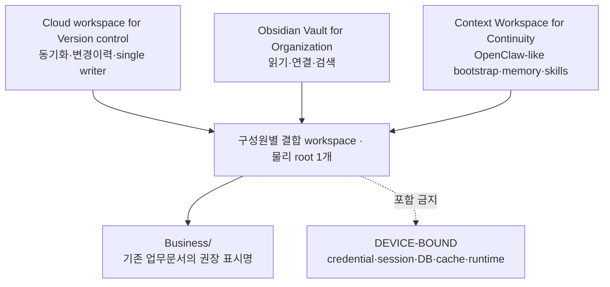
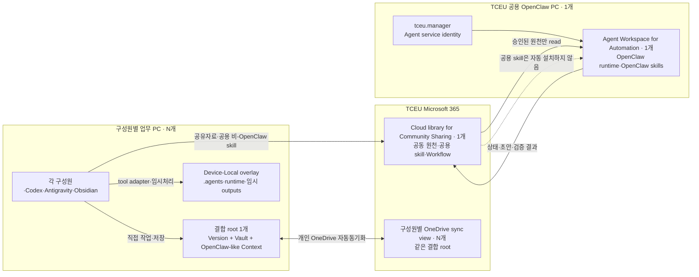
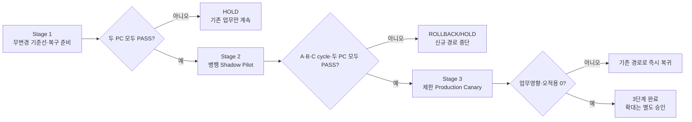

# TCEU 구성원 업무 PC와 공용 OpenClaw PC 연계 Runbook

> Google Drive 링크를 어느 PC의 Codex에 어떻게 입력할지는 [TCEU Runbook 링크를 LLM으로 실행하는 방법](./tceu-runbook-llm-usage-guide.md)부터 본다. 이 문서는 Stage·Gate·검증·rollback의 실행 정본이다.

## 1. 목적과 범위

이 문서는 TCEU 구성원들의 업무 PC와 `tceu.manager` Microsoft 365 계정으로 로그인한 **공용 OpenClaw PC**를 편리하고 안정적으로 연결하는 단계별 적용 기준이다. 최우선 설계가치는 **일상 사용 편의성**이며, 정상 사내 문서작업에서 별도 승인·복사·outbox·수동 Cloud 게시가 반복되지 않게 한다. 모든 TCEU PC가 실제 업무에 사용 중이라는 사용자 진술을 전제로 하므로, 적용 중에도 기존 업무경로를 유지하고 두 검증 대상 PC가 함께 합격할 때만 다음 단계로 진행한다. 공용 OpenClaw PC는 특정 개인의 전용 장비가 아니라 사용자 포함 5명의 TCEU 구성원이 함께 사용하는 Agent 노드다. 구성원 실명은 공유 Runbook에 반복하지 않고, 조직이 승인한 제한 registry에서 역할과 내부 참조키로 관리한다.

목표는 일곱 가지다.

1. 요청·검토·승인을 실제 구성원 task에 귀속하고 공용 OpenClaw는 허용된 업무만 실행한다.
2. 기존 Telegram Agent 정의를 Specialist Lane의 원천으로 사용하고 persona를 재작성하지 않는다.
3. Agent Workspace for Automation과 Cloud library for Community Sharing은 조직 전체에서 각각 하나만 유지한다.
4. 구성원별 결합 root 하나가 Version·Vault·portable OpenClaw-like Context 세 역할을 수행한다.
5. 정상 내부작업은 저장·자동동기화로 인계하고 승인은 외부발송·파괴·권한·credential·제한자료에만 둔다.
6. System Master 조승현이 공용 Skill을 관리하며 `tceu.manager` service identity와 구분한다.
7. System Master가 각 Gate의 비민감 evidence와 판정을 이 Runbook 17장에 반영하고, 반복 검증된 원칙만 공통문서에 환류한다.

대표 업무 PC와 공용 OpenClaw PC의 로컬 폴더·동기화 상태, OpenClaw runtime은 2026-08-17 read-only audit로 확인했다. 두 PC를 포함한 TCEU PC의 실제 업무 사용과 5인 공동사용은 사용자 진술로 확인했지만, 구성원별 접속방식이 Telegram인지 물리·원격 OS 로그인인지, identity·session·권한이 어떻게 분리되는지는 아직 확인되지 않았다. Microsoft 365 tenant의 실제 owner·ACL·정본 위치, 회사 정책과 pilot 결과도 미확인이다. 따라서 현재 상태는 `baseline-observed / production-rollout-proposed`이며, `APPLY` 전에는 6장의 준비조건과 8장의 Stage 1 Gate를 모두 통과해야 한다.

### 범위 밖

- SULJANG 또는 다른 고객 시스템과의 연결
- TCEU 전체 SharePoint·Teams·메일의 자동 순회
- 외부 발송, 고객 응답, 계약 승인, 결제 실행
- Microsoft 365 관리자 권한 또는 공유정책의 묵시적 변경
- OpenClaw workspace·credential·session·DB의 Cloud 동기화

## 2. 다섯 기능 위치

| 공식 명칭 | 개수 | TCEU에서의 정본 |
|---|---:|---|
| **Agent Workspace for Automation** | 조직 전체 1개 | 공용 OpenClaw PC의 local workspace. OpenClaw runtime skill도 여기에 속함 |
| **Cloud library for Community Sharing** | 조직 전체 1개 | 현재 존재하는 TCEU 공용폴더를 우선 재사용하며 OpenClaw 참조 여부에 따라 최소 최적화 |
| **Cloud workspace for Version control** | 구성원당 논리 역할 1개 | 각 구성원의 회사 개인 OneDrive 결합 workspace |
| **Obsidian Vault for Organization** | 구성원당 논리 역할 1개 | 같은 결합 workspace를 Vault로 열어 사용 |
| **Context Workspace for Continuity** | 구성원당 논리 역할 1개 | 같은 결합 workspace의 portable OpenClaw-like framework: bootstrap·identity·memory·개인 skill·인계 |

이를 **공용 1+1 / 개인 3역할×N** 구조로 부른다. `N`은 TCEU 구성원 수이며 `3역할`은 물리 폴더 3개를 뜻하지 않는다. 현재처럼 세 역할이 같은 OneDrive root를 가리키는 구성을 기본으로 유지하고, 규제·권한·반복 충돌·색인/수명주기 문제가 실제로 확인될 때만 필요한 부분을 분리한다. 구성원 PC에는 별도의 Agent Workspace for Automation을 만들지 않으며, 공용 OpenClaw PC에도 별도의 Cloud workspace for Version control을 기본 추가하지 않는다.

### 2.1 확인된 현재 구조

| 영역 | 2026-08-17 audit + 2026-08-19 사용자 정의 | 해석 |
|---|---|---|
| audit된 대표 업무 PC의 결합 workspace | 약 2.1만 파일·38GB이며 Cloud workspace for Version control, Obsidian Vault for Organization, Context Workspace for Continuity 역할과 일부 agent/runtime 성격 파일이 함께 존재 | 다른 구성원 PC에 자동 일반화하지 말고 각 기기 상태를 확인 |
| Cloud library for Community Sharing | audit된 업무 PC 기준 약 4.2천 파일 중 98% 이상이 online-only이고 공용 OpenClaw PC에서도 별도 local sync path로 보인다는 사용자 진술 | 현재 구조를 우선 보존하고 OpenClaw가 실제 참조·색인·입출력하는 하위경로를 확인한 뒤 이동 없는 최적화 범위를 결정 |
| audit된 구성원의 개인 3역할 | 개인 OneDrive의 같은 물리 폴더가 Cloud workspace for Version control, Obsidian Vault for Organization, Context Workspace for Continuity를 함께 수행한다는 사용자 정의 | 현 결합을 기본 유지하고 다른 구성원 PC도 exact path와 실제 분리 필요성만 확인 |
| 공용 OpenClaw PC의 Cloud workspace for Version control | 현재 없으며 새 기본구조에서도 만들지 않음 | 과거 Agent release workspace 제안은 superseded; OpenClaw skill 정본은 local Agent Workspace for Automation에 유지 |
| OpenClaw PC | Windows Node와 WSL Gateway가 한 PC에서 연결되고 Telegram channel이 동작 | network·secret·exec 범위를 줄인 뒤 Node·Telegram 회귀시험 필요 |
| OpenClaw workspace | 약 1.9만 파일·29GB이며 Doc Dive, output, cache/index/quarantine과 운영문서가 혼재 | canonical workspace가 아니라 lifecycle이 다른 여러 파생영역의 집합으로 취급 |
| Agent routing | `main`, `teams-intake` 두 Agent가 있으나 binding은 없고 같은 workspace를 사용 | 토픽별 session과 실제 workspace·memory·tool 격리는 별개 |
| 두 PC의 동기화 snapshot | 같은 조직 공유 원천을 보더라도 파일수·논리용량·online-only 상태가 다름 | 같은 시점·같은 가용성을 가정하지 말고 task별 preflight 필요 |
| 공용 사용자 모델 | 사용자 포함 5명의 TCEU 구성원이 하나의 OpenClaw PC와 하나의 Agent Workspace for Automation을 공동 사용한다고 보고됨 | service account·Telegram topic·Agent identity와 실제 요청자·승인자를 분리해야 함 |

수치는 시점별 snapshot이며 용량계획용 대략값이다. 원문명·내용·credential은 이 Runbook의 증거로 복제하지 않는다.

### 2.2 endpoint-neutral 현재·목표 매핑

| 공식 역할 | 위치 | 핵심 계약 |
|---|---|---|
| Agent Workspace for Automation | `<shared-openclaw-local-workspace>` | 조직 전체 1개; OpenClaw 실행·runtime skill |
| Cloud library for Community Sharing | `<member-community-sharing-view>` / `<shared-openclaw-community-view>` | Cloud 정본 1개; 두 local view의 cloud identity는 Stage 1에서 검증 |
| Cloud workspace for Version control | `<member-combined-workspace>` | 구성원별 결합 root의 working copy·provider history 역할 |
| Obsidian Vault for Organization | `<member-combined-workspace>` | 같은 root를 Vault로 열어 탐색 |
| Context Workspace for Continuity | `<member-combined-workspace>` | 같은 root의 portable OpenClaw-like framework |

정확한 Windows 경로는 local-only `tceu-storage-role-paths` adapter에서만 관리한다. 개인 세 역할은 하나의 물리 root를 공유하고 credential·session·DB·cache·실행 runtime만 DEVICE-BOUND로 제외한다.

LLM 실행 Prompt에는 endpoint의 audit 범위를 고정하기 위해 다섯 역할 필드를 모두 주입한다. 각 구성원 PC는 `AGENT_WORKSPACE_PATH=NOT_APPLICABLE`, 자기 `COMMUNITY_SHARING_PATH`, 그리고 같은 결합 root를 가리키는 `VERSION_WORKSPACE_PATH=OBSIDIAN_VAULT_PATH=CONTEXT_WORKSPACE_PATH`를 사용한다. 공용 OpenClaw PC는 `AGENT_WORKSPACE_PATH`와 자기 `COMMUNITY_SHARING_PATH`를 사용하고 개인 세 역할은 `NOT_APPLICABLE`이다. 실제 절대경로는 현재 PC의 Prompt와 local adapter 밖으로 복제하지 않고 공유 evidence에는 역할별 `PATH_RESOLVED` 같은 상태만 남긴다.

### 2.3 하나의 폴더를 보는 세 가지 관점



세 역할은 서로 다른 복사본이 아니라 **같은 파일을 다르게 사용하는 책임**이다. Cloud workspace for Version control은 시간과 변경이력, Obsidian Vault for Organization은 사람의 탐색, Context Workspace for Continuity는 LLM의 정체성·기억·skill·인계를 담당한다.

### 2.4 Context Workspace for Continuity의 portable OpenClaw-like core

```text
<member-combined-workspace>/
├── AGENTS.md                 # LLM 공통 운영규칙·memory 로딩 방법
├── SOUL.md                   # 응답·행동 원칙
├── IDENTITY.md               # 개인 Agent 역할
├── USER.md                   # 비민감 업무 맥락만
├── MEMORY.md                 # 증류된 장기 기억
├── memory/                   # 날짜별 portable 작업기억
├── compound/lessons.md       # 반복 교훈
├── skills/                   # 개인 비-OpenClaw skill 정본
│   └── <skill-name>/
│       ├── SKILL.md
│       ├── scripts/
│       ├── references/
│       └── runtime-requirements.yaml
├── Business/                 # 기존 업무문서의 권장 영어 표시명
└── .obsidian/                # Obsidian local UI 설정
```

`Business/`를 기본 영어명으로 권장한다. 다만 위 tree는 **목표 역할표**이지 일괄 생성·이동 명령이 아니다. 이미 안정적으로 사용하는 업무 폴더명이 있으면 그대로 두고 `Business` 역할로 매핑한다. 이름이 없거나 새 범위를 만들 때만 `Business/`를 사용하며 기존 자료의 rename·이동은 Stage 2 별도 변경창과 회귀시험 없이는 하지 않는다.

| Agent Workspace for Automation | Context Workspace for Continuity |
|---|---|
| 공용 OpenClaw가 실제 자동화를 실행 | 개인 LLM이 OpenClaw 방식으로 문맥을 이어감 |
| runtime skill·task runtime·검증 output 가능 | portable instruction·memory·개인 skill만 유지 |
| credential·session·DB·cache는 local runtime에서 사용 가능 | credential·session·DB·cache·raw log·executable runtime 금지 |
| OpenClaw가 직접 로드 | Codex/Antigravity/Obsidian이 파일로 읽고 tool adapter는 얇게 유지 |

장치별 파생영역은 OneDrive 밖에 둔다.

```text
%USERPROFILE%/
├── .agents/skills/                    # Codex 사용자 범위의 얇은 loader
└── .local/
    ├── agent-config/                  # Context·runtime 경로 adapter
    ├── skill-runtimes/                # Skill별 package·runner·resolver
    ├── agent-runtimes/shared-node/    # 임시 Node 작업 runtime
    └── agent-outputs/<workspace-id>/  # 임시 분석·render·log
```

Cloud Context에는 portable Skill 정본과 내구성 있는 업무결과만 둔다. Codex loader는 `%USERPROFILE%\.agents\skills`에서 정본을 가리키는 작은 일반파일로 장치별 생성하며, 다른 LLM은 `skills/` 정본 또는 자기 local adapter를 사용한다. Codex가 사용자 범위 Skill을 읽는 위치는 [OpenAI 공식 Skill 문서](https://learn.chatgpt.com/docs/build-skills#where-codex-loads-local-skills)를 따른다. 동명 노출을 막기 위해 TCEU 전용 loader 이름에는 `tceu-` prefix를 사용한다.

`node_modules`, package cache, runtime, Junction·symlink, credential과 장치 절대경로는 Device-Local이다. Cloud의 기존 `.agents`와 `outputs`는 삭제부터 하지 않고 내용을 분류한다. loader 전환·대표 Skill 실행이 PASS한 뒤 Cloud `.agents`를 retire하고, 임시 output만 local `agent-outputs`로 전환한다. 최종 문서·handoff·검토 대상은 처음부터 기존 `Business` 또는 project에 직접 저장하므로 수동 게시단계가 생기지 않는다.

### 2.5 Direct Workspace 일상 계약

1. 구성원은 `<member-combined-workspace>` 또는 그 안의 기존 project를 Codex/Antigravity와 Obsidian에서 직접 연다.
2. LLM은 `AGENTS.md → USER.md → MEMORY.md → 관련 memory·project` 순으로 필요한 문맥만 읽는다.
3. 정상 문서·context·최종 output은 같은 root의 기존 project에 직접 저장하고, 임시 output만 Device-Local에서 처리한다.
4. 한 task·한 current writer를 지키며 외부발송·공유확대·파괴적 변경·권한·제한자료만 승인받는다.
5. 규제·권한차이·반복 충돌·색인/retention 장애가 실제 확인될 때만 문제 범위만 분리한다.

고정된 `TCEU-Agent-Library`, 역할별 root, outbox를 먼저 만들지 않는다. 기존 Community Sharing 경로와 개인 결합 root를 보존하고 gap에만 최소 overlay를 추가한다.

## 3. 목표 아키텍처



### 핵심 경계

- 공용 정본은 Agent Workspace for Automation과 기존 Cloud library for Community Sharing 각 1개다.
- 개인 정본은 구성원별 결합 root 1개이며 portable OpenClaw-like core와 `Business` 역할을 함께 둔다.
- `.agents`, executable runtime과 임시 `outputs`는 장치별 파생영역이며 Cloud 정본으로 취급하지 않는다.
- OpenClaw runtime skill / 공용 비-OpenClaw skill / 개인 skill은 각각 Agent Workspace / Community Sharing / 개인 Context에 두고 자동 복제하지 않는다.
- `tceu.manager`는 service identity이고, 실제 requester·approver·session·task attribution은 구성원별로 구분한다.
- 승인된 materialized 입력만 OpenClaw가 읽으며 cache·index·output·quarantine은 정본으로 간주하지 않는다.

## 4. Cloud library for Community Sharing 최적화 Process

현재 공용폴더를 새 구조로 교체하지 않는다. 아래 순서로 **in-place 최적화**하고, OpenClaw 사용 여부에 따라 변경강도를 달리한다.

1. **현재 구조 기록:** 폴더·owner·writer·materialization·대표 업무를 read-only로 기록한다.
2. **OpenClaw 의존성 확인:** config, adapter, prompt, skill, Doc Dive/index, task 입출력에서 참조되는 하위경로를 비민감 경로 참조키로 정리한다.
3. **경로 분류:** `OPENCLAW-ACTIVE`, `OPENCLAW-REFERENCE`, `HUMAN-SHARED`, `UNKNOWN`으로 나눈다.
4. **변경강도 결정:** active/reference는 경로를 보존하고 metadata·allowlist·writer·materialization만 개선한다. human-only는 필요할 때만 정리하며 unknown은 이동하지 않는다.
5. **최소 gap 보완:** 기존 위치가 역할을 충족하지 못할 때만 작은 control/skill/output overlay를 추가한다. 전체 tree 재구성은 하지 않는다.
6. **회귀검증:** OpenClaw read·search·task·output과 구성원 업무가 그대로 동작하는지 확인하고 실패하면 overlay만 제거한다.

기존 폴더를 아래 **논리 역할**에 매핑한다. 이름이 다르다고 새 폴더를 만들지 않는다.

| 논리 역할 | 구성원 업무 PC | 공용 OpenClaw PC | 최적화 규칙 |
|---|---|---|---|
| Request/Approved Input | 요청·승인 | 허용 task만 읽기 | 기존 OpenClaw input 경로가 있으면 이름·위치 보존 |
| Control/Shared Skills | Runbook·공용 skill 열람·편집 | 참조만; runtime 자동설치 금지 | 기존 적합 위치 우선, 없을 때만 최소 overlay |
| Status/Draft/Output | 상태·검토·승인 | task 상태·초안·검증결과 작성 | 기존 writer 계약 보존, task별 single writer |
| Feedback/Archive | 비식별 feedback·보존 결정 | 비식별 evidence 게시 | 자동 삭제·전체 bulk copy 금지 |

Microsoft 365의 Team Site와 연결된 SharePoint는 팀·프로젝트 공동 파일과 그룹 기반 권한 관리에 적합하다. 실제 site와 권한구조는 TCEU 관리자의 정책을 우선한다. 참고: [SharePoint sharing and permissions](https://learn.microsoft.com/en-us/sharepoint/modern-experience-sharing-permissions), [Teams and SharePoint integration](https://learn.microsoft.com/en-us/sharepoint/teams-connected-sites).

기존 조직 공유 폴더는 이름을 바꾸거나 이동하지 않는다. `TCEU-Agent-Library` 같은 overlay 이름은 기존 구조로 역할을 충족할 수 없고 Stage 2에서 필요성이 검증된 경우에만 후보로 사용한다.

### 4.1 Skill Scope·System Master 운영계약

Skill의 위치가 Scope를 결정하며 자동 수집·양방향 복제를 하지 않는다. TCEU System Master는 **조승현 1명**이다. Master는 공용 Skill을 동료 승인 없이 직접 등록·수정·폐기하고, 일반 구성원은 후보만 제출한다. 부재 시 명시된 Acting Master 한 명만 임시 승계한다. 이 기술 역할은 업무내용·외부발송·Microsoft 365 권한 승인자를 대신하지 않는다.

| Scope | 유일한 정본 | 쓰기 계약 |
|---|---|---|
| OpenClaw runtime | Agent Workspace for Automation `skills/` | runtime 변경 작업의 writer |
| 공용 비-OpenClaw | Community Sharing의 기존 `Shared-Skills` 역할 | System Master만 등록·변경 |
| 개인 | 작성자 Context `skills/`의 portable definition | 작성자만; runtime·package는 Device-Local, 자동 공유 금지 |

기존 공용폴더의 적합한 위치를 먼저 사용한다. 없을 때만 Stage 2 `2-A`에서 `Shared-Skills`와 `Shared-Skill-Candidates` 논리 overlay를 만든다.

공용 catalog `README.md`는 `skill_name, purpose, canonical_relative_path, system_master, status, verified_with, last_verified`만 기록한다. 실제 절대경로는 local-only adapter의 `personal_skills_root`, `shared_skills_root`, `openclaw_runtime_skills_root`, `local_codex_skills_root`, `local_skill_runtime_root`, `local_shared_node_runtime`, `local_agent_outputs_root`에 둔다.

분류가 애매하면 개인으로 시작한다. 호출은 `개인 Skill: <name>` 또는 `공용 Skill: <name>`으로 Scope를 명시하고, 동명은 `HOLD`한다. 일반 구성원은 민감요소를 제거한 candidate만 제출하며 Master가 게시한다. 공용→runtime은 별도 시험, 폐기는 catalog `retired`+archive, 복귀는 Skill과 catalog의 같은 version 복원으로 처리한다. credential·고객 원문·절대경로를 Skill에 넣거나 공용 본문을 개인 폴더에 복제하지 않는다. 실행 검증은 Stage 2 `2-B`가 정본이다.

## 5. 계정과 권한 원칙

### `tceu.manager`

`tceu.manager`는 TCEU 관리의 Agent 전용 Microsoft service identity다. 승인된 Workflow·표본에만 최소권한을 주고 전체 Microsoft 365 background crawl, 외부발송·권한·계약·결제를 기본 금지한다. credential은 OS·Microsoft 365 인증영역에 두며 기록에는 실제 구성원 참조키와 acting Agent를 함께 남긴다.

### 구성원 identity와 공용 노드

구성원은 승인된 개별 identity로 요청·승인하고 공유 기록에는 제한 registry의 비식별 `member_ref`만 쓴다. 공용 지식은 Lane에 둘 수 있지만 개인 요청·승인·restricted 접근·draft는 task-scoped local context에 격리한다. 실제 OS·원격·Telegram·Codex 접속방식과 감사 가능성은 Stage 1에서 확인한다.

### 권장 역할표

| 행동 | 요청 구성원 | 검토·승인 구성원 | `tceu.manager` Agent | TCEU 관리자 |
|---|---:|---:|---:|---:|
| 요청 생성·취소 | 허용 | 확인 | 상태 확인·실행 금지 | 정책상 필요 시 감사 |
| 승인 입력 등록 | 본인승인 허용범위만 | 허용 | 읽기 | 정책 설정 |
| 자동화 실행 | 요청·중단 | 중단 | 허용범위 실행 | 실행범위 승인 |
| draft 게시 | 검토 | 검토 | 허용 | 감사 가능 |
| 최종 승인 | 저위험만 정책에 따라 | 허용 | 금지 | 필요 시 공동 승인 |
| 외부 발송 | 별도 승인 요청 | 승인정책에 따라 | 기본 금지 | 정책 승인 |
| Library 권한 변경 | 금지 | 금지 | 금지 | 허용 |

## 6. APPLY 전 준비조건

다음 항목이 하나라도 불명확하면 상태를 `BLOCKED_INPUT`으로 유지한다.

| 확인 항목 | 합격 기준 |
|---|---|
| 조직·System Master | TCEU 관리자 승인, System Master 조승현·업무 승인자·변경 책임자와 Acting Master 규칙 확인 |
| service account | `tceu.manager` owner·MFA/CA·복구와 사람 identity 분리 확인 |
| Cloud 정본·권한 | site·library·item identity·owner·ACL·retention과 선택 경로 최소권한 확인 |
| 두 PC 동기화 | 같은 승인 표본의 timestamp·size·availability·materialization을 각 PC에서 독립 확인 |
| Workspace 구조 | 공용 1+1, 구성원별 결합 root 1개와 Version·Vault·portable Context·`Business` mapping 확인 |
| OpenClaw dependency | active/reference/human/unknown 분류와 read·index·task·output 회귀기준 확인 |
| Skill Scope | runtime/shared/personal 정본, catalog·candidate·Master writer와 자동복제 금지 확인 |
| Portable Skill·파생영역 | Context의 `.agents`·`outputs`·`node_modules`·Junction·Node import inventory, portable 정본·local loader/runtime·임시 output 목표와 rollback 확인 |
| 데이터·DEVICE-BOUND | Agent 허용·금지 등급, 외부 AI 정책, credential·runtime·제한자료 제외 확인 |
| identity·session | requester·approver·actor 귀속, 공용 지식과 사용자/task 비공개 memory 격리 확인 |
| 동시성 | 고유 task ID, single writer, 중복 claim 거부와 우선순위 확인 |
| 보안 P0 | Gateway loopback, SecretRef, exec allowlist·승인, 설정 hash와 복귀시험 준비 |
| 업무 연속성 | 기존 경로·대표 회귀동작·변경창·중단조건과 기존 업무 우선 복구 확인 |
| 동시 Gate | 같은 rollout·Stage·표본, 독립 checkpoint, 한쪽 실패 시 두 PC 모두 HOLD |
| RTO·evidence | Stage 1·2 중단 0분, Stage 3 RTO 사전 승인, 대상 밖 evidence 위치 준비 |

OneDrive Files On-Demand에서는 파일이 온라인에만 있을 수 있다. Stage 1에서는 현재 pin·materialization 상태만 read-only 기록한다. Stage 1 GO 뒤 `2-A In-place optimization`의 별도 `APPLY`에서만 OpenClaw가 실제로 읽는 기존의 제한된 요청·입력·상태 경로를 `Always keep on this device`로 설정하고 실제 local file인지 검증한다. 참고: [Microsoft Files On-Demand](https://support.microsoft.com/en-us/office/save-disk-space-with-onedrive-files-on-demand-for-windows-0e6860d3-d9f3-4971-b321-7092438fb38e).

전체 Source Library를 고정하거나 일괄 다운로드하지 않는다. 첫 시험은 합성자료 1건 또는 승인 파일 최대 10개로 제한하고, 예상 밖 materialization이 시작되면 즉시 중단한다.

### 6.1 보안 P0 Gate

새 Cloud bridge나 Specialist Lane을 `APPLY`하기 전에 다음을 별도 DRY-RUN하고 rollback 가능성을 확인한다.

1. Gateway의 외부 노출 필요성을 검토하고 기본을 loopback으로 제한한다.
2. 평문 secret 필드를 OS credential store 또는 지원되는 SecretRef로 전환한다.
3. `exec`는 업무별 allowlist와 사람 승인 기준을 적용한다.
4. 변경 전 설정 사본·hash와 Windows Node 재연결 절차를 확보한다.
5. 변경 후 Telegram 연결, Node pairing, 핵심 Doc Dive read-only 작업을 회귀시험한다.
6. 10분 안에 정상상태로 복구할 수 없거나 channel이 단절되면 즉시 rollback한다.

## 7. Task 실행 계약

요청과 상태는 `TCEU-YYYY-NNN-request.yaml`, `TCEU-YYYY-NNN-status.yaml` 한 쌍으로 관리한다.

| 계약 | 필수 필드 |
|---|---|
| 요청 | `task_id`, `rollout_id/stage`, `created_at`, 비식별 requester·role, 비민감 summary, 승인 input reference, output 유형, data classification, deadline·stop conditions |
| 상태 | 같은 task·rollout, `state`, current writer·acting Agent·service, updated 시각, 비민감 evidence·output reference, approval 상태·비식별 approver, blocker, rollback 상태 |

`external_send_allowed=false`를 기본으로 하고 credential·개인정보 원문·고객 비밀·공유 URL을 넣지 않는다. 상태는 `queued → claimed → running → review_required → approved → completed`이며 `cancelled/blocked/failed`에서 재개하려면 사람의 원인 확인과 rollback·재시도 승인이 필요하다.

## 8. 업무중단 없는 3단계 동시 도입

### 8.1 공통 진행 원칙

초기 적용 대상은 **System Master 업무 PC 1대**와 **공용 OpenClaw PC 1대**이며 System Master가 두 endpoint Prompt를 직접 실행한다. 다른 구성원 PC는 이 3단계를 통과한 뒤 별도 변경요청과 기기별 Stage 1 audit를 거쳐 확장한다.



- 기존 업무방식은 Stage 3 승인 종료까지 **운영 기준경로**로 유지한다.
- 두 PC는 같은 `rollout_id`, Stage, 표본과 시간창을 사용하되 각 PC에서 증거를 독립 수집한다.
- 한쪽만 합격한 `부분 GO`는 없다. 한쪽이 `HOLD` 또는 `ROLLBACK`이면 두 PC 모두 다음 단계로 진행하지 않는다.
- 한 번의 적용창에는 한 종류의 변경만 넣는다. OneDrive, OpenClaw 보안, Specialist Lane, 자동 pickup을 같은 batch로 변경하지 않는다.
- Direct Workspace 안의 정상 문서 편집·저장·자동동기화는 변경창이나 개별 승인의 대상이 아니다.
- 재시작·업데이트·대량 동기화는 회의·마감·고객 대응 시간과 겹치지 않는 승인된 변경창에서만 한다.
- Stage 1·2의 업무중단 목표는 0분이다. Stage 3의 최대 복귀시간은 TCEU가 사전에 승인하며, 미정이면 `BLOCKED_INPUT`이다.
- 변경 책임자와 업무 승인자가 서로 확인한 checkpoint evidence가 없으면 다음 단계로 가지 않는다.

### Stage 1 — 무변경 동시 Baseline·복구 준비

**목표:** 설정과 파일을 바꾸지 않고 두 PC의 정상 업무상태, 차이, 복귀경로를 같은 시점에 고정한다.

| PC | 실행 | 정상 적용 확인 | 오적용 확인 |
|---|---|---|---|
| System Master 업무 PC | OS·OneDrive·Obsidian·Codex 상태, 기존 업무경로, 승인 표본의 timestamp·size·materialization을 read-only 기록 | 승인된 기존 문서 read-only 열람·Obsidian 검색·OneDrive sync 상태 확인이 모두 PASS | 새 파일·폴더·download·pin·저장·권한·설정 변경이 하나라도 생기면 오적용 |
| 공용 OpenClaw PC | Gateway·Node·Telegram·Agent·workspace·동기화 snapshot, 설정 hash와 복귀 절차를 read-only 기록 | Gateway·Node·Telegram 연결상태와 승인된 Doc Dive/Community 표본의 metadata 가용성 확인이 모두 PASS | service restart, config write, 메시지 발송, bulk materialization, secret 노출 또는 업무 응답 지연이 생기면 오적용 |

필수 작업:

1. `rollout_id`와 변경 책임자·업무 승인자·변경창·복귀 목표를 기록한다.
2. 하나의 Cloud library for Community Sharing과 구성원별 결합 workspace의 owner·writer·reader를 문서로만 확인한다. 세 개인 역할이 같은 root를 가리키는 현재 상태도 기록한다.
3. `community_test_item_ref`로 사전 승인된 비민감 기존 표본 1개를 지정한다. 두 PC의 Community Sharing local view에서 같은 표본의 상대경로·cloud item/site/library identity·존재·가용성·timestamp·size를 각각 기록한다. 이름이나 상대경로만 같으면 동일성 증거가 아니며, content hash는 이미 materialize된 승인 표본에만 사용한다.
4. config·adapter·prompt·skill·Doc Dive/index·task 입출력에서 Community Sharing의 어떤 하위경로를 OpenClaw가 참조하는지 read-only dependency map을 만든다. `UNKNOWN` 경로는 이동대상으로 잡지 않는다.
5. audit된 구성원의 결합 workspace에서 portable OpenClaw-like core와 기존 업무폴더의 `Business` 역할 mapping을 기록한다. 누락 파일은 제안만 하고 새 root·rename·이동은 하지 않는다.
6. 개인 Direct Workspace의 `.agents`, `outputs`, `node_modules`, Junction·symlink, Node import·실행 스크립트를 read-only inventory한다. portable 정본, Codex loader, 내구성 있는 업무결과, 임시 output, Device-Local Runtime으로 분류하고 자동 이동하지 않는다.
7. requester·approver·acting Agent·`tceu.manager` service identity가 분리되는지 확인한다.
8. System Master 업무 PC는 `기존 승인 문서 read-only 열람`, `Obsidian 검색`, `OneDrive sync 오류 없음`의 세 동작을 확인한다. 공용 OpenClaw PC는 `Gateway·Node 상태`, `Telegram 연결상태`, `승인된 Doc Dive/Community 표본 metadata 가용성`을 확인한다. Stage 1에서는 저장·메시지 발송·materialization을 하지 않는다.
9. 설정 사본 위치, 되돌릴 담당자와 검증순서를 기록하되 실제 설정은 변경하지 않는다.
10. 대표 업무 PC에서 Codex·Antigravity가 현재 결합 workspace 또는 기존 project를 직접 열 수 있는지, OneDrive 동기화와 일상 인계 마찰을 기록한다.

Stage 1의 유일한 쓰기는 사전 승인된 감사 evidence 위치 또는 현재 Codex task에 checkpoint를 기록하는 것이다. audit 대상 workspace·설정·Cloud 경로에는 쓰지 않는다. evidence target이 없으면 `HOLD`한다.

**Stage 1 관찰 완료:** 대상 시스템 변경·업무중단·예상 밖 다운로드 0건이고 두 PC baseline, 폴더 역할표와 복귀절차가 기록됨.

**Stage 1 → Stage 2 GO:** 두 PC exact local path, 공용 1+1/개인 3역할×N, 개인 역할의 같은-root 매핑, Community Sharing의 OpenClaw dependency class, Direct Workspace·version recovery·DEVICE-BOUND 제외 기준, skill 분류, Node runtime 분리계획, 변경창과 복귀 목표가 `resolved`여야 한다. Context 안의 Junction·symlink 또는 `node_modules`가 sync 오류를 일으키는 경우 검증된 remediation과 OneDrive 회귀 PASS 전까지 `HOLD`다. OpenClaw 참조 여부가 불명확한 경로를 이동·rename 대상으로 잡았거나 개인 역할 분리 필요성이 입증되지 않았어도 `HOLD`다.

**즉시 HOLD:** 어느 한 PC에서 쓰기·설정변경·대량 materialization이 발생하거나 기존 업무 회귀시험이 실패함. 원인을 설명하기 전 Stage 2 금지.

업무 중인 endpoint에서는 queue 수, index 갱신시각, task-state처럼 정상 운영으로 계속 변하는 값이 있을 수 있다. 변화가 있다는 사실만으로 실패 처리하지 않고 `ROLLOUT_CAUSED`, `EXPLAINED_BASELINE_DRIFT`, `UNRESOLVED`로 분류한다. 이번 rollout·audit가 만든 유해 변화이거나 업무영향을 설명할 수 없는 변화만 blocker로 유지한다. 정상업무에서 발생한 것으로 시간·process·task 근거가 맞고 audit 자체 변경이 0이면 `EXPLAINED_BASELINE_DRIFT`로 기록하며, 정지 상태를 만들기 위해 업무를 중단하지 않는다.

#### Stage 1-R — Node Skill runtime 차단요인 복구

Stage 1에서 Context Workspace 안의 `node_modules` Junction 때문에 OneDrive sync 오류가 확인된 경우에만 System Master 업무 PC에서 실행하는 제한 복구창이다. 세 단계 구조를 늘리는 새 Stage가 아니라 Stage 1 GO를 막는 관찰된 원인의 remediation이다.

1. 공통 Prompt Set의 `PROMPT-39`를 실제 local 경로로 완성하고, 미치환값이 있으면 변경 없이 중단한다.
2. Context의 portable definition은 유지하고 Codex loader는 `%USERPROFILE%\.agents\skills`에 일반파일로 만든다. local runner·resolver self-check, package import, 대표 Skill·임시 스크립트, loader→정본 참조와 package cache 보존을 검증한다.
3. 모든 검증이 PASS한 뒤 Junction 연결점만 제거하고 target package cache는 보존한다. 누락 package는 자동 설치하지 않는다.
4. Context 안 `node_modules=0`, Junction·symlink=0, Cloud `.agents` 잔존 항목=0, OneDrive sync 오류=0, 기존 문서·Obsidian 검색·대표 Skill 실행 PASS를 확인한다.
5. 실패하면 Junction을 유지하거나 사전상태로 복귀하고 `HOLD`한다. 광범위 폴더 재구성이나 Version·Vault·Context 분리는 하지 않는다.
6. 완료 후 같은 rollout의 양쪽 Stage 1 checkpoint를 다시 통합한다. 이 endpoint만 성공해도 부분 GO로 처리하지 않는다.

#### Stage 1-H — 통합 HOLD 해소·재검증

현재 `TCEU-ROLLOUT-2026-001`의 HOLD를 한 번에 광범위하게 수정하지 않는다. [LLM 사용 안내서](./tceu-runbook-llm-usage-guide.md)의 Prompt H로 아래 입력과 원인을 먼저 정리하고, Node sync blocker가 남아 있을 때만 Stage 1-R을 별도 변경창으로 실행한다. 그 뒤 기존 Prompt A→B→C→D를 같은 rollout로 다시 수행한다.

| HOLD 항목 | 해소 방법 | PASS 기준 |
|---|---|---|
| 공용 Agent Workspace `PATH_MISSING` | 공용 PC의 실행 중인 OpenClaw config·process·workspace 설정에서 현재 경로 후보를 read-only로 찾고 System Master가 확인한다. 새 workspace를 만들지 않는다. | Prompt B 입력과 실제 runtime workspace가 일치해 `PATH_RESOLVED` |
| Community 시험 항목 불일치 | 현재 표본의 상대경로·Cloud 위치를 다시 확인한다. 양쪽에 이미 존재하는 승인된 비민감 표본이 아니면 기존 공통 표본으로 교체하되 파일 생성·download·pin은 하지 않는다. | 같은 cloud item/site/library identity이며 양쪽에서 존재·가용성·metadata 비교 가능 |
| Cloud identity·ACL evidence 부족 | 현재 인증된 OneDrive/SharePoint view에서 site·library·item과 owner/reader/writer 관계를 확인하고 공유 결과에는 `SAME_CLOUD_ITEM`·역할 상태만 남긴다. | identity 일치와 필요한 읽기·쓰기 역할이 `RESOLVED`; 실제 ID·URL은 local-only |
| member runtime 후보·`node_modules` 4개 | 각 항목을 portable definition, loader, Device-Local Runtime 또는 미분류로 판정한다. Context 안 항목이 남거나 sync 오류가 있으면 Prompt R을 실행한다. | Context `node_modules=0`, Junction·symlink=0, 대표 Skill·OneDrive·Obsidian 회귀 PASS |
| 기존 업무 회귀 미실행 | member의 문서 read·Obsidian 검색·OneDrive 무오류와 shared의 Gateway·Node·Telegram 연결·승인 표본 metadata를 무변경으로 확인한다. | 양쪽 `regression_checks_passed=true`, 업무중단 0분 |
| queue·index·task-state 변화 | 적용 전후 시각, 관련 process/task, audit 변경목록으로 인과관계를 분류한다. 정상 운영을 멈추거나 queue를 임의 정리하지 않는다. | `ROLLOUT_CAUSED` 유해 변화 0, `UNRESOLVED` 중대 변화 0; 정상 변화는 `EXPLAINED_BASELINE_DRIFT` |
| Gateway authentication·session 격리 | bind·접근경로·인증방식·구성원별 session/task 귀속을 read-only로 확인한다. 별도 변경이 필요하면 OneDrive/Node 변경과 섞지 않고 다음 승인 변경창으로 분리한다. | 외부노출·무인증이면 계속 HOLD; 제한된 접근과 사람/task 귀속이 증명되면 baseline risk로 명시 |
| 승인·복귀 입력 미정 | System Master는 기술 변경·rollback 책임자를 지정하고 업무 승인자, 변경창, 목표 복귀시간을 확인한다. | 네 항목 모두 `RESOLVED`; service account는 사람 승인자가 아님 |

Stage 1-H는 **HOLD를 지우기 위한 서류 작업**이 아니라 잘못된 입력, 실제 runtime blocker, 정상 운영 drift를 분리하는 절차다. 해결되지 않은 항목은 그대로 HOLD하고, 영향이 다른 변경을 같은 창에 넣지 않는다.

### Stage 2 — 병행 Shadow Pilot

**목표:** 기존 업무결과를 그대로 사용하면서, 합성 또는 비식별 자료로 Direct Workspace의 **직접편집→자동동기화→다음 LLM 인계**와 공용 OpenClaw workflow를 병행 검증한다.

범위는 **System Master+일반 구성원 1명**, audit된 대표 업무 PC+공용 OpenClaw PC의 두 endpoint, A·B·C workflow task 총 4건과 합성 Skill 표본 3건으로 고정한다. 일반 구성원은 기존 승인된 접속방식으로 candidate를 제출하고 그 사람의 개인 PC는 변경하지 않는다. 개인 격리 표본은 대표 업무 PC의 Master Context에서 검증한다. 실제 업무 Skill 변경, 기존 경로 이동·rename, polling·cron·외부발송·원천 overwrite·Power Automate는 금지한다.

Stage 수는 셋을 유지하되 Stage 2 안에서는 다음 내부 Gate를 직렬로 통과한다. 각 행은 **서로 다른 변경창**이며 앞 Gate가 PASS하기 전 다음 작업을 하지 않는다.

| 내부 Gate | 한 변경창에서 허용하는 일 | PASS 기준 |
|---|---|---|
| `2-A In-place optimization` | existing Community Sharing 경로 매핑과 필요한 최소 metadata/overlay만 적용 | 기존 OpenClaw 참조경로 이동·rename 0, 두 번째 Library 0, 회귀시험·rollback PASS |
| `2-B Portable core·Skill scope` | 합성 Skill 3건으로 portable 정본, local Codex loader/runtime, 임시 `outputs` local화와 catalog·동명·복귀 검증 | Cloud `.agents` 잔존 항목·임시 `outputs`·`node_modules`·Junction 0; 최종 output은 project에 직접 저장; loader·import·대표실행·OneDrive 회귀 PASS |
| `2-C Direct Workspace·Shadow cycles` | 기존 결합 workspace/project를 Codex/Antigravity에서 직접 열고 A·B·C cycle 실행 | 새 역할 root·기존 `Business` 폴더 rename·수동 인계 0, 자동동기화·후속 LLM 가시성·version 복원 PASS |

공통 합격 기준은 다음과 같다.

| 축 | PASS | 실패 시 |
|---|---|---|
| 두 PC·업무 | 같은 task·writer·state, 기존 경로 정상, 업무중단 0 | 둘 다 `HOLD`; 임의 최신본 선택 금지 |
| Identity·권한 | requester·approver·Agent·service identity 귀속, 허용 project만 write | 교차문맥·원천쓰기면 `ROLLBACK` |
| Cloud·Context | 공용 1+1, 개인 same-root, portable core·Business 보존 | 신규 정본·role root·rename이면 `ROLLBACK` |
| Skill·local overlay | 세 Scope 단일 정본, Master writer, local `.agents`·runtime·임시 outputs, 무자동복제 | 표본 격리·이전 version 복귀 |
| 사용성 | 정상 저장·동기화·LLM 인계에 승인·복사·게시 0 | workflow 교정 또는 `HOLD` |
| OpenClaw | active/reference 무이동, unknown 무변경, 신규 claim 중지 가능 | overlay 제거·기존 경로 복귀 |

실행은 `Stage 1 재확인 → 2-A → 2-B → 2-C Cycle A 1건 → B 1건 → C 동시 2건` 순서다. 각 Gate는 별도 변경창이며 매 cycle 후 두 PC state·hash·writer·materialization, conflict 0, version 복원과 업무 회귀를 확인한다. 실패 표본은 삭제·덮어쓰기하지 않는다.

**Stage 2 GO:** `2-A/2-B/2-C`, workflow task 4건과 Skill 표본 3건이 모두 PASS하고, 참조경로·기존 업무 rename·신규 역할 root·Master 외 공용 변경·후보 조기노출·개인 교차노출·동명 임의선택·본문 복제·conflict·DEVICE-BOUND 유입이 0건이다. 공용 Skill과 문서 version 복원 각 1회, 수동 인계·정상편집 승인 0회, 두 PC checkpoint 일치도 필요하다.

**즉시 ROLLBACK:** 원천 변경, 다른 task/사용자 문맥 노출, 승인 없는 final, 외부발송, 중복 writer 또는 기존 업무 영향이 1건이라도 발생함.

### Stage 3 — 제한 Production Canary

**목표:** 영향이 낮은 실제 업무 1종만 새 경로로 처리하되, 기존 경로로 즉시 돌아갈 수 있는지 확인한다.

진입 전 업무 owner는 업무유형, Direct Workspace, 자료등급, 관찰기간과 복귀 목표를 한 번 확인한다. 그 뒤 정상 내부 문서 편집·저장·동기화에는 개별 승인을 요구하지 않는다. 외부발송·공유확대·권한변경만 사람 승인 Gate를 유지하며, 자동 polling·Power Automate·전체 토픽 확대는 포함하지 않는다. 실제 업무와 Agent 변경의 실패 원인을 섞지 않기 위해 Stage 3도 두 내부 Gate를 서로 다른 변경창에서 직렬 실행한다.

| 내부 Gate | 범위 | PASS 기준 |
|---|---|---|
| `3-A Workflow canary` | 저위험 실제 업무 **1종**, 최소 3건 또는 업무 owner가 정한 한 번의 완전한 업무주기 중 더 엄격한 기준 | 기존 OpenClaw skill 변경 없이 두 PC task·업무 회귀·복귀시험 PASS |
| `3-B Skill placement canary` | System Master가 비실행형 실제 공용 Skill 1개를 직접 등록 | 타인 승인 0, 기존 OpenClaw 참조경로·개인 root·runtime 무변경, rollback PASS |

`3-A`만 통과하면 업무 workflow는 검증됐지만 skill 분류는 `partial`이다. 두 기능을 최종 적용 완료로 부르려면 `3-A`와 `3-B`가 모두 PASS해야 한다.

| Checkpoint | 대표 업무 PC | 공용 OpenClaw PC | 합격기준 |
|---|---|---|---|
| 사전 | 기존 업무 가능, 입력 allowlist·승인자 확인 | Node·Telegram·Gateway·용량·queue 정상 | 두 PC PASS, 예상 변경목록 승인 |
| 실행 중 | 요청·검토·승인, 업무 체감 지연 기록 | task 1건만 claim, 허용 workspace만 write | source 변경·외부발송·교차 task 접근 0 |
| 복귀 시험 | 기존 방식으로 같은 업무를 계속할 수 있음 | 신규 intake·claim·publish 비활성화 가능 | 승인된 목표시간 안에 복귀, 증거 보존 |

**Stage 3 GO:** `3-A`와 `3-B`를 직렬로 통과하고, 승인된 관찰기간 동안 업무중단·오적용·예상 밖 변경 0건, 각 task와 skill 표본의 두 PC checkpoint 일치, 기존 경로와 Agent baseline 복귀시험이 모두 성공.

**Stage 3 오적용·즉시 ROLLBACK:** 승인 업무·참여자·폴더·자료등급·시간창 밖 접근, source 또는 기존 업무파일 변경, 다른 task/사용자의 문맥노출, 승인 없는 final·외부발송, 두 PC 상태 불일치, 사용자 체감 업무오류 중 하나라도 발생하면 신규 intake·claim·publish를 끄고 기존 경로로 복귀한다.

**Stage 3 완료의 의미:** 이 두 PC와 승인 업무 1종의 canary가 검증된 것이다. 다른 구성원 PC, 다른 업무, scheduled pickup, SharePoint List·Power Automate, 외부발송과 전체 Specialist Lane 확대는 각각 별도 DRY-RUN·승인·적용 Gate가 필요하다.

### 8.2 단계 판정 기록

각 PC는 아래 레코드를 별도로 남기고, 두 레코드를 대조해 하나의 Stage 판정을 만든다.

```yaml
rollout_id: "TCEU-ROLLOUT-YYYY-NNN"
stage: 1 | 2 | 3
internal_gate: "1 | 2-A | 2-B | 2-C-A | 2-C-B | 2-C-C | 3-A | 3-B"
endpoint: member-work-pc | shared-openclaw-pc
checkpoint: pre | post | rollback
recorded_at: "ISO-8601"
baseline_refs: []
task_id: "or empty"
skill_sample_id: "or empty"
folder_contract_hash: "sha256 or unavailable-with-reason"
access_snapshot_ref: "비민감 owner·ACL evidence 참조"
community_test_item_ref: "승인된 비민감 표본의 상대 참조 또는 unavailable-with-reason"
materialization_state: exact | partial | online-only | unavailable | not-applicable
role_path_status:
  agent_workspace: PATH_RESOLVED | PATH_MISSING | PATH_ROLE_MISMATCH | NOT_APPLICABLE
  community_sharing: PATH_RESOLVED | PATH_MISSING | PATH_ROLE_MISMATCH
  version_workspace: PATH_RESOLVED | PATH_MISSING | PATH_ROLE_MISMATCH | NOT_APPLICABLE
  obsidian_vault: PATH_RESOLVED | PATH_MISSING | PATH_ROLE_MISMATCH | NOT_APPLICABLE
  context_workspace: PATH_RESOLVED | PATH_MISSING | PATH_ROLE_MISMATCH | NOT_APPLICABLE
community_sharing_identity_ref: "비민감 cloud item/site/library identity 또는 unavailable-with-reason"
personal_three_roles_same_root: true | false | not-applicable
business_health:
  existing_workflow_available: true
  user_visible_interruption_minutes: 0
  regression_checks_passed: true
expected_changes: []
observed_changes: []
unexpected_changes: []
cross_pc_state_ref: "same rollout/stage/task reference"
rto_target_minutes: 0
rto_actual_minutes: 0
verdict: GO | HOLD | ROLLBACK
approved_by_ref: "비식별 업무 승인자 참조키"
evidence_summary: "비민감 검증요약"
```

통합 판정은 두 PC가 모두 `GO`이고 `unexpected_changes`가 비어 있을 때만 `GO`다. 증거가 없거나 한쪽이 미검증이면 실패가 아니라 `HOLD`로 기록한다.

## 9. 검증 체크리스트

8장의 Stage별 PASS 기준이 실행 정본이다. 최종 수용 시 아래만 재확인한다.

| 축 | 최종 확인 |
|---|---|
| 두 PC·업무 | 같은 rollout과 독립 checkpoint, 부분 GO·업무중단·예상 밖 변경 0, 기존 경로 유지 |
| Workspace | 공용 1+1·개인 same-root, portable core·`Business` mapping, 신규 root·rename 0 |
| Cloud·Version | 같은 cloud item·materialization 확인, conflict 0, provider history·Git·backup 구분과 복원 PASS |
| Skill·Master | 세 Scope 단일 정본, 조승현 Master와 `tceu.manager` 분리, candidate·동명·복귀 시험 PASS |
| Identity·Lane | requester·approver·actor 귀속, 교차문맥 0, read-only 원천 쓰기 거부 |
| 경계 | DEVICE-BOUND·Cloud runtime 유입, active/reference 이동, unknown 변경 0 |
| 복구·확대 | stale이면 중단, 기존 경로 복귀; 다른 PC·업무·polling·외부행동은 별도 변경요청 |

Cache·index manifest에는 `task_id`, 비민감 `source_ref`, source/fetched 시각, hash 또는 불가사유, reconciliation 상태, expiry, bytes, capacity, retention 결정을 둔다. 없거나 stale이면 정본으로 표시하지 않으며 삭제·deduplication은 별도 `APPLY`다.

## 10. 운영 주기

- **매 작업:** `결합 workspace 열기 → portable core로 문맥 확인 → Business 문서 직접 작업·저장 → 자동동기화 → 다음 LLM·Obsidian이 계속 → feedback`.
- **매주/매월:** 주간에는 blocked/failed·중복·처리시간·무승인 output·sync conflict를, 월간에는 `tceu.manager` 권한·미사용 자동화·복원 rehearsal·Insight 승격을 확인한다.

## 11. 중단과 rollback

다음 중 하나면 신규 intake·claim·publish를 중단하고 기존 업무경로만 유지한다.

- 예상 밖 Library·메일·Teams 접근, source/materialization 변경 또는 credential·민감원문 log 노출
- 승인 없는 final·외부발송, 교차사용자 문맥·무권한 승인 노출
- sync conflict·중복 task·state/output 불일치 또는 한쪽 checkpoint 누락
- 업무 지연·오류·CPU/disk/sync 급증, 계정 잠금 또는 관리자 정책 변경

Rollback은 `신규 intake·claim·publish 중지 → 두 PC HOLD/ROLLBACK 일치 → 기존 업무 우선 복구 → task/evidence 보존 → 예상 밖 변경만 승인 사본으로 복원 → OneDrive·Telegram·Node 회귀시험 → Feedback 기록` 순서다. Cloud draft·원천·기존 업무파일은 임의 삭제하지 않으며 두 rollback checkpoint가 모두 PASS하기 전 자동화를 재활성화하지 않는다.

## 12. 적용 기록과 컨설팅 지식 환류

적용·실패·불편·시간절감은 별도 파일을 만들지 않고 17장의 현재 상태와 Gate 이력에 간결하게 기록한다. System Master가 [LLM 사용 안내서](./tceu-runbook-llm-usage-guide.md)의 Prompt D로 갱신하며, 반복 검증된 구조적 통찰만 비식별화해 공통 Prompt Set과 분석 리포트로 승격한다.

## 13. Telegram 전담 Agent를 Specialist Lane으로 연결하는 계약

이 Runbook은 뚝딱씨, 꼼꼼씨, DocDive 등 기존 Agent의 성격을 새로 정의하지 않는다. Telegram의 토픽 설명·고정 메시지·반복된 행동·연결된 skill과 rule을 원천으로 확인하고, 사용자가 승인한 정의만 OpenClaw routing이 참조한다.

공식 구현 기준은 [OpenClaw Parallel specialist lanes](https://docs.openclaw.ai/concepts/parallel-specialist-lanes)와 [OpenClaw Telegram topic routing](https://docs.openclaw.ai/channels/telegram)이다. Topic별 `agentId`를 지정하면 workspace, memory, session을 분리할 수 있지만, global model·browser·shell·network 용량은 공유 병목으로 남을 수 있다.

### 13.1 Agent 정의 발견 순서

`Telegram 토픽·고정 메시지·사용자 정의 → 연결된 skill/rule → 사용자 검토` 순서로 찾는다. 대화 추정은 `inferred`로 남기며 승인된 Agent ID와 local `source_ref`만 OpenClaw에 연결한다. 공유문서에는 persona 전문과 실제 chat/topic/user ID를 기록하지 않고 `display_name`, `source_type/ref`, 관찰시각, reviewer, approval, contract hash만 둔다.

### 13.2 Lane 계약의 필수 요소

각 Lane은 `Purpose, Non-goals, Chat budget, Handoff, Tool-risk, Evidence`만 별도 계약한다. Coordinator는 최소 3개 Lane의 routing·memory·skill·handoff가 검증된 뒤 중복요청·blocker 요약용으로만 검토한다.

### 13.3 TCEU 도입 수준

| 수준 | 적용 | 상태 |
|---|---|---|
| `LANE-0` | 토픽별 session은 분리되지만 단일 `main` Agent 사용 | 현 OpenClaw PC에서 observed |
| `LANE-0A` | `main`, `teams-intake`가 같은 workspace를 쓰고 topic binding이 없음 | 2026-08-17 observed baseline |
| `LANE-1` | Telegram 기존 Agent 정의 발견·승인, lane contract 작성 | 권장 다음 단계 |
| `LANE-2` | 토픽별 전담 `agentId`와 독립 workspace·memory·skill·tool policy | proposed |
| `LANE-3` | 우선순위·동시성·coordinator | pilot 후 proposed |

첫 기술 분리는 기존 Agent의 성격을 새로 쓰는 작업이 아니라 권한이 다른 두 Lane의 계약을 검증하는 작업이다.

- **Doc Dive read-only Lane:** 승인된 Source Library와 cache를 읽되 원천·일반 Documents 쓰기를 거부한다.
- **CSS writer Lane:** 승인된 CSS delta 경로와 allowlist 명령만 쓴다.

성격·말투·업무 전문성은 Telegram에 이미 정의된 Agent 원천을 참조한다. routing 100%, cross-lane memory 노출 0, read-only write 거부 100%가 확인되기 전에는 다른 토픽으로 확대하지 않는다.

## 14. Grok Bot에서 차용하는 선택 옵션

TCEU에서 Grok Bot 제품 자체를 도입하는 것이 아니라, 초기 beta에서 강조되는 사용 패턴을 OpenClaw·Telegram·Microsoft 365 구조에 대응시킨다. 초기 제품 정보는 변동성이 높으므로 각 옵션은 독립 pilot로 검증한다.

| 옵션 | TCEU 대응 구현 | 권고 |
|---|---|---|
| `GROK-PATTERN-1` | 새 bot 생성 대신 Telegram에 이미 정의된 Agent를 대화형 온보딩 원천으로 사용 | 즉시 DRY-RUN |
| `GROK-PATTERN-2` | 전문 Agent별 상태, 독립 workspace·memory, Telegram 진행 표시 | 3개 Lane pilot |
| `GROK-PATTERN-3` | Agent 간 compact handoff, 승인된 반복 routine | manual handoff 3회 후 |
| Cloud computer 패턴 | 별도 Grok Cloud PC 대신 현 TCEU OpenClaw PC를 dedicated managed node로 사용 | 중복 도입 비권장 |

반복 routine은 사용자와 Agent가 작업 단계를 대화로 확정하는 방식을 차용할 수 있다. 단, “학습했다”는 대화 기억이 아니라 버전된 routine 계약·샘플·승인자·rollback이 존재하고 회귀시험을 통과했다는 뜻으로만 사용한다.

## 15. 구성원 업무 PC·Codex·OneDrive·SharePoint·공용 OpenClaw 배치표

| 위치 | 보관 내용 |
|---|---|
| 구성원 결합 root | portable Context·개인 Skill 정본·Business·최종 output |
| 구성원 Device-Local | Codex `.agents` loader·runtime·임시 `outputs`·경로 adapter |
| Community Sharing | 공동 원천·공용 Skill·Workflow |
| 공용 Agent Workspace | OpenClaw runtime·runtime Skill |
| Telegram | 요청·상태·Lane; `tceu.manager`는 service identity |

## 16. 어디에 무엇을 두고 어떻게 Prompt를 입력할지

실제 Drive 링크, System Master 업무 PC Codex용 Prompt, 공용 OpenClaw PC Codex용 Prompt와 두 결과의 통합판정·Runbook 반영 형식은 [TCEU Runbook 링크를 LLM으로 실행하는 방법](./tceu-runbook-llm-usage-guide.md)에 한 번만 유지한다. 이 장은 각 endpoint가 지켜야 할 배치·역할 계약만 설명한다.

최초 적용의 구성원 endpoint는 System Master 업무 PC로 고정한다. System Master가 먼저 안내서 Prompt 0으로 placeholder 없는 실행 Prompt와 rollout·승인 표본·Runbook edit target을 확정한 뒤 자기 PC와 공용 OpenClaw PC를 각각 점검하고, 통합판정 뒤 Prompt D로 17장을 갱신한다. 다른 구성원 PC는 최초 3단계 완료 뒤 별도 확대한다.

### 16.1 Stage별 문서 배치와 변경 한도

| Stage | 두 PC에 제공하는 자료 | 허용되는 배치 | 금지 |
|---|---|---|---|
| Stage 1 | 이 Runbook, 공통 Prompt Set, 비식별 customer profile의 승인된 읽기 전용 사본·첨부 | 기존 구조 확인과 대상 밖 승인 evidence 위치 기록 | audit 대상 새 폴더·파일·pin·sync·설정 생성 |
| Stage 2 | Stage 1 자료 + 합성 project, workflow task 4건, Skill 표본 3건 | 기존 위치 재사용, `Business` mapping, Master·candidate·개인 격리·version 복귀 검증 | 기존 경로 rename, 개인 역할 분리, 이중 정본, runtime·credential Cloud 저장, 자동설치·polling·외부발송 |
| Stage 3 | Stage 2 자료 + 저위험 업무범위·복귀계획 | 정상 내부 문서는 Own Workspace에서 처리; 비실행형 공용 skill 1건으로 배치 canary | 정상편집별 승인·수동 게시, 다른 업무·기기·토픽·자동화 확대 |

Stage 1은 기존 읽기 가능한 사본만 사용한다. GO 후에도 Runbook·Prompt·evidence는 기존 적합 위치를 우선 사용하고, 없을 때만 최소 control overlay를 선택한다. 절대경로, topic/user ID, system prompt와 secret은 local adapter/config에만 둔다.

### 16.2 TCEU 구성원 업무 PC의 Codex에 입력

안내서의 Prompt A를 사용한다. 적용 역할은 Community Sharing과 같은 root의 Version·Vault·Context이며 Agent Workspace는 `NOT_APPLICABLE`이다. portable 정본·최종 output은 결합 root, `.agents` loader·runtime·임시 output은 Device-Local이다. 정상 project 저장은 승인 없이 직접 수행하고 외부발송·공유확대만 별도 승인한다.

### 16.3 OpenClaw PC의 Codex에 입력

안내서의 Prompt B를 사용한다. 적용 역할은 Agent Workspace와 Community Sharing이며 개인 Version·Vault·Context는 `NOT_APPLICABLE`이다. 기존 OpenClaw active/reference 경로와 Telegram Agent 정의를 보존한다. Specialist Lane 확대는 별도 변경요청이다.

### 16.4 Telegram의 OpenClaw에 입력

안내서 7장의 짧은 task Prompt만 사용한다. Telegram에는 상태·blocker·승인 결정만 남기며 requester·approver·acting Agent·service identity를 분리한다.

### 16.5 Stage 3에서 검증할 일상 운영 순서

`결합 workspace 직접 작업·저장 → 자동동기화 → 필요 시 Telegram task → 공용 Agent 실행 → 외부발송만 승인 → 17장 갱신` 순서다. 모든 상태는 하나의 `task_id`를 사용하며 Cloud가 stale/offline이면 claim하지 않는다.

## 17. System Master 적용 기록

### 17.1 기록 책임과 갱신 순서

최초 적용은 `Prompt 0 입력완성 → System Master 업무 PC Prompt A → 공용 OpenClaw PC Prompt B → System Master 통합 Prompt C → Runbook 반영 Prompt D` 순서로 끝낸다. System Master만 이 장의 현재 상태와 Gate 이력을 갱신한다. unresolved placeholder가 있는 Prompt는 Stage 결과를 만들지 않고 `INPUT_TEMPLATE_INCOMPLETE`로 중단한다. 결과가 `HOLD` 또는 `ROLLBACK`이어도 그대로 기록하며, 기록 완료가 다음 Gate의 자동 실행 권한이 되지는 않는다.

실제 절대경로·credential·tenant/topic/user ID·고객 문서 원문은 기록하지 않는다. 다섯 역할 경로는 `PATH_RESOLVED`, `PATH_MISSING`, `PATH_ROLE_MISMATCH`, `NOT_APPLICABLE` 상태로만 남긴다.

### 17.2 현재 적용 상태

| 항목 | 현재값 |
|---|---|
| 실행 책임자 | System Master |
| 현재 rollout | `TCEU-ROLLOUT-2026-001 · Stage 1 Gate 1 integrated HOLD` |
| 마지막 완료 Gate | 없음 |
| System Master 업무 PC | Agent Workspace `NOT_APPLICABLE`; Community Sharing·Version·Vault·Context `PATH_RESOLVED`; Version·Vault·Context `same-root=true` |
| 공용 OpenClaw PC | Agent Workspace `PATH_MISSING`; Community Sharing `PATH_RESOLVED`; Version·Vault·Context `NOT_APPLICABLE` |
| 다섯 역할 경로 | member 적용 4개 `PATH_RESOLVED`·1개 `NOT_APPLICABLE`; shared 적용 1개 `PATH_RESOLVED`·Agent Workspace `PATH_MISSING`·개인 3개 `NOT_APPLICABLE` |
| endpoint coverage | `COMPLETE_BUT_NOT_READY` · 양쪽 checkpoint 존재, shared Agent Workspace 적용경로 미해결 |
| Community 시험 항목 | `TEST_ITEM_NOT_COMMON` · member에는 없음; shared에는 3,149,851 bytes·modified `2026-08-17T20:16:41Z`·materialization `exact`로 존재; 같은 항목의 metadata 충돌이 아니라 양쪽 공통 표본 선정·가용성 실패 |
| Community Sharing 동일성 | `HOLD` · System Master의 동일 Cloud item 확인 기록은 있으나 현재 member local item이 없고 Cloud item/site/library ID·owner·ACL evidence가 없음 |
| 기존 업무 회귀 | `HOLD` · 양쪽 `existing_workflow_available=true`, `regression_checks_passed=false`, 업무중단 0분; Community 최상위 목록 member 13·shared 14 |
| Device-Local overlay | `PROPOSED` · Cloud `skills/` 정본 유지, Codex `.agents`·runtime·임시 `outputs` local화; 실제 파일 이동·설정변경 0 |
| Blocker | shared Agent Workspace `PATH_MISSING`; 양쪽 공통 시험 항목 미선정; Cloud identity·권한 evidence 부족; member의 OneDrive 무오류·Business mapping·DEVICE-BOUND 제외 미검증 및 `node_modules` 4개·runtime 후보 미분류; shared Gateway 보안·insecure authentication·session 격리 미해결; 승인자·변경창·RTO·복귀 담당 미확정 |
| 예상 밖/운영 변화 분류 | `UNRESOLVED` · member 시험 항목 누락·이전 checkpoint 대비 문서 변경; shared 실패 queue `59→60`, index 갱신시각 변경, 비-template task-state 1개 출현; 양쪽 `audit_generated_changes=[]`이나 발생 주체·정상 업무·rollout 연관성은 아직 미분류 |
| 통합 판정 | `HOLD` · 부분 GO 금지, Stage 2 금지 |
| 다음 행동 | LLM 사용 안내서의 Prompt H로 현재 HOLD 입력을 완성한다. member `node_modules`·OneDrive blocker가 남으면 Prompt R을 별도 실행하고, shared Agent Workspace·공통 시험 항목·Cloud identity·승인/복귀 입력을 확정한다. queue·index·task-state는 rollout 인과관계를 분류한 뒤 양쪽 Prompt A→B→C→D를 같은 rollout로 재실행한다. |
| 최종 갱신 | 2026-08-21 · Stage 1 HOLD evidence 유지; Device-Local overlay 계약 반영과 TCEU semantic prune 완료, field 재실행 결과 미수집 |

### 17.3 Gate 이력

| Rollout | Gate | 두 endpoint | 경로·Cloud | 업무 회귀 | 예상 밖 변경 | 판정 | 다음 행동 | 기록일 |
|---|---|---|---|---|---:|---|---|---|
| `UNASSIGNED` | Stage 1 input preflight | 경로상태만 보고됨 | 경로 resolved 보고·Cloud identity 미확인 | 미통과 | 0 | `HOLD` | Prompt 0으로 실제 rollout·표본·edit target을 확정하고 A·B 재실행 | 2026-08-20 |
| `TCEU-ROLLOUT-2026-001` | Stage 1 Gate 1 pre | member-work-pc · shared-openclaw-pc | member 적용역할 `PATH_RESOLVED`; shared Community `PATH_RESOLVED`·Agent Workspace `PATH_MISSING`; 시험 항목 `TEST_ITEM_NOT_COMMON`; Cloud identity `HOLD` | false | member item 누락; shared queue `59→60`·index·task-state 변화는 `UNRESOLVED` | `HOLD` | Prompt H로 입력·identity·회귀·drift를 분류하고 필요시 Prompt R 후 양쪽 Gate 1 pre 재실행; Stage 2 금지 | 2026-08-20 |

### 17.4 Runbook write-back 완료조건

Prompt D의 갱신은 다음을 모두 만족해야 완료다.

1. `rollout_id`, 단일 Gate, 승인 표본, 편집 대상과 실제 A·B·C 결과가 확정되어 있고 unresolved placeholder가 없다.
2. Prompt C가 본 Runbook version과 편집 대상 version이 호환된다.
3. 17.2는 최신 통합 결과로 교체되고 17.3은 `rollout_id+gate`당 한 행만 가진다.
4. endpoint별 다섯 역할 상태, Community Sharing 동일성, 업무 회귀, blocker·unexpected change, verdict와 다음 행동이 빠짐없이 기록된다.
5. 실제 절대경로와 제한정보는 포함되지 않는다.
6. frontmatter patch version과 `last_reviewed`가 갱신되고 문서 구조 검사가 통과한다.

직접 편집이 불가능하면 사본을 만들지 않고 `RUNBOOK_WRITEBACK_BLOCKED`로 남긴다. System Master는 원본 Runbook을 편집할 수 있는 Codex에서 UPDATE_PACKET을 적용한 뒤에만 해당 Gate 기록을 완료로 본다.
