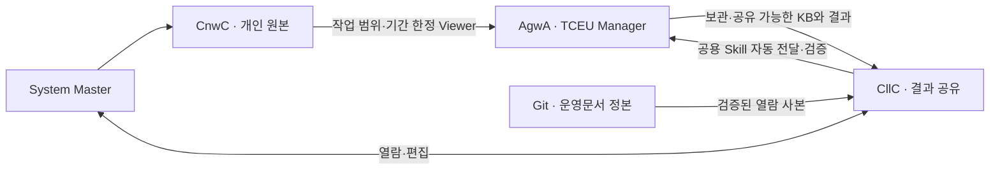

# TCEU 두 PC 운영 Runbook

**목적:** System Master가 TCEU Manager의 KB와 작업 결과를 쉽게 활용하고, 개인 원본은 필요한 작업 동안만 공유한다. 기존 업무를 유지하며 필요한 연결만 추가한다.

이 Git 문서가 운영 기준의 정본이다. CllC에는 검증된 열람 사본을 두고, 실제 계정·장치 경로·제한된 원천 위치는 공개 Git 밖에서 관리한다. 실행 방법은 [LLM 사용 안내서](./tceu-runbook-llm-usage-guide.md)를 따른다. 문서 갱신은 권한 설정·자동화 구현·현장 검증 완료를 뜻하지 않는다.

## 1. 공간과 책임

| 공간 | 담당·위치 | 운영 계약 |
|---|---|---|
| **CnwC — Context Workspace for Continuity** | System Master의 업무 PC·개인 회사 OneDrive | 개인 문맥과 업무 원본. TCEU Manager 계정에는 필요한 폴더만 임시 Viewer |
| **AgwA — Agent Workspace for Automation** | 공용 TCEU Manager PC의 기존 WSL OpenClaw workspace | 자동화 실행·runtime Skill·보관 허용된 RAG. 개인 민감자료 저장 금지 |
| **CllC — Cloud library for Community Sharing** | TCEU Manager 계정 소유 OneDrive의 TCEU_Manager/CllC | 공유 가능한 KB·결과·운영문서. System Master 계정에 Editor 공유 |
| Cloud workspace for Version control | System Master의 기존 CnwC와 같은 물리 root | working copy·변경이력. 별도 폴더를 늘리지 않음 |
| Obsidian Vault for Organization | 같은 CnwC root; 필요하면 CllC 결과도 열람 | 사람이 문서를 탐색하는 도구. 실행·동기화 엔진으로 취급하지 않음 |

System Master는 사람 책임자, TCEU Manager는 OpenClaw 별칭, Agent용 Microsoft 365 계정은 service identity다. 요청자·검토자·실행 Agent를 구분하며 계정을 사람 승인자로 취급하지 않는다.

CllC는 두 PC 사이의 결과 공유 공간이다. 기존 조직 SharePoint 원천 라이브러리를 교체하거나 통째로 복제하지 않는다. 과거의 “기존 조직 공용폴더가 곧 CllC” 전제는 이번 구조로 대체한다. 다른 구성원·고객·자동화로의 확대는 현재 범위에 포함하지 않는다.



## 2. 적게 복제하고 바로 사용하기

- CnwC의 Version·Vault·Context는 한 root를 유지한다. 기존 업무 폴더를 그대로 쓰며, `Business`는 논리 역할명일 뿐 rename 지시가 아니다.
- CnwC에는 portable 지침·정제된 기억·개인 Skill·최종 업무문서를 둔다. bootstrap, identity, memory, skills는 필요한 기존 파일만 읽고 빠졌다는 이유만으로 전부 생성하지 않는다.
- loader·패키지·가상환경·임시 출력·세션·자격증명·실행 DB·브라우저 프로필은 장치 로컬에 둔다. AgwA 전체나 실행 DB를 OneDrive와 양방향 동기화하지 않는다.
- CllC의 `Knowledge/`는 공유 가능한 읽기용 KB, `Artifacts/`는 작업별 결과, `README.md`는 시작 안내다. 공용 Skill이나 상태표는 실제 필요할 때 기존 적합 위치를 사용한다.
- 정상적인 비민감 내부 결과는 CllC 작업 파일에 직접 저장하고 자동동기화한다. 이미 허용된 편집마다 별도 승인·outbox·수동 게시 단계를 추가하지 않는다.
- 원천·KB·배포본의 책임을 구분한다. AgwA에서 내보낸 KB는 원천 참조와 버전을 표시하고, 사람이 CllC에서 수정했으면 재배포 전에 비교한다. 문서별 current writer는 한 명이며 충돌을 임의의 최신본 선택으로 해소하지 않는다.
- Git은 운영문서 변경이력, OneDrive는 파일 동기화와 제공되는 버전 이력, backup은 복구 수단이다. 서로를 대체한다고 가정하지 않고 필요한 파일 복원을 실제 시험한다.

## 3. 임시 공유와 민감정보

**열람 권한과 보관 권한은 별개다.** CnwC 및 System Master 소유의 공유 OneDrive 폴더는 항상 임시 접근으로 취급한다.

| 대상 | 처리 |
|---|---|
| 민감·개인 원문과 이를 재현하는 요약·추출문·OCR·임베딩·스크린샷 | AgwA 메모리·RAG·파일·로그와 CllC에 저장하지 않음 |
| 임시 공유 입력의 분류가 불명확한 파생물 | 보관하지 않고 비민감화한 입력 또는 보존 범위 결정을 요청 |
| 독립적으로 보관·공유가 허용된 비민감 자료와 결과 | 허용 범위에 한해 AgwA 처리·CllC 제공 |
| 원천 위치 기억 | 소유자 역할, 비민감 폴더 별칭·위치 참조, 사용 목적, 재공유 필요 여부만 기록 |
| 임시 공유 URL·토큰, 실제 계정·개인 경로 | 공개 Git에 기록하지 않음. 접근 토큰은 영구 기억에도 남기지 않음 |

폴더명 자체가 민감하면 중립 별칭과 소유자가 알아볼 수 있는 제한된 위치 참조를 사용한다. 위치를 확인하지 못했으면 추정해 기록하지 않는다.

작업마다 현재 권한을 확인하고, 접근이 없거나 회수되면 해당 입력을 필요로 하는 작업을 멈춘다. 다른 계정·과거 다운로드·캐시로 우회하지 않고 필요한 폴더만 Viewer로 다시 요청한다. 공유 범위를 Agent가 넓히지 않는다.

임시 자료는 자동 동기화·고정 다운로드·예약 크롤링·상시 색인 대상에서 제외한다. 민감 내용을 자동 저장하는 세션·도구라면 원문을 넣기 전에 비민감화된 입력이나 저장하지 않는다고 검증된 처리 경로를 요청한다. 문구만으로 무저장을 보장하지 않는다.

공유 회수는 이미 생성된 사본을 없애지 않는다. 기존 AgwA의 민감자료 존재 여부와 잔존 범위는 별도 확인 대상이며, 발견 시 해당 접근·검색·배포를 먼저 중지하고 합의된 범위로 제거·재색인·백업 처리를 검증한다. 임의 전체 삭제나 “공유 해제=삭제 완료” 판정은 하지 않는다.

## 4. 작업·KB 인계

1. **요청:** 작업 목적, 원천 범위, 자료등급, 결과 위치, 완료 기준을 정한다. 여러 단계·세션이 필요한 경우에만 고유 `task_id`를 사용한다.
2. **접근:** 위치 참조와 현재 권한을 확인한다. CnwC가 닫혀 있으면 필요한 기간·폴더를 명시해 재공유를 요청한다.
3. **실행:** 해당 task의 허용 입력만 읽고 지정 위치에 쓴다. 중복 claim을 거부하고 다른 사용자·task의 비공개 문맥과 분리한다.
4. **인계:** 보관 가능한 결과를 CllC에 저장한다. 같은 task 안에 결과 상대경로·버전·확인 시점·제한사항을 짧게 남긴다.
5. **완료:** 로컬 저장, Cloud 반영, System Master 열람을 구분해 확인한다. 업무상 승인이 필요한 결과는 검토가 끝나기 전 최종 승인으로 표시하지 않는다. 개인 원본 공유는 소유자가 회수한다.

장기 작업의 최소 기록은 `task_id / requester / actor·writer / input_ref·등급 / state / output_ref / updated_at / blocker·next_action`이다. 승인·만료·복귀 정보는 해당 작업에 필요할 때 추가한다. 상태는 `queued → running → review_required(필요 시) → completed`, 예외는 `blocked / failed / cancelled`로 충분하다. 상태표를 유지하려고 단순 작업마다 YAML 파일을 만들지 않는다.

KB는 먼저 사람이 읽을 수 있는 Markdown으로 제공한다. 원문·청크·검색 DB를 일괄 내보내지 않는다. 기계 검색용 export가 필요하면 원천별 보존·공유 권한, 완전성, 최신성, 갱신 방법부터 정한다.

보관 허용된 KB에는 `source_ref / source_updated_at / fetched_at / export_version / 보존·만료 기준 / 검증 상태`를 기록한다. hash는 허용된 비민감 파일에만 사용하고 불가하면 사유를 남긴다. cache·index의 크기와 보존기간을 관리하며 stale·부분 색인은 최신 정본으로 제시하지 않는다. 문서·Wiki·Issue 등 서로 다른 원천은 갱신주기와 스키마를 유지하고 필요할 때 검색 결과를 합친다.

외부 발송·권한 확대·원천 덮어쓰기·삭제·계약·결제는 해당 행동의 명시적 권한이 필요하다. 기존 사용자 지시로 허용된 범위는 반복 승인받지 않는다. Telegram에는 요청·상태·결과 참조만 전달하며 민감 원문이나 전체 Runbook을 상시 투입하지 않는다.

## 5. 공용 Skill: 저장하면 AgwA에서 사용

### 5.1 정본 하나, 평소에는 저장만

**공용 Skill은 처음부터 `CllC/Shared-Skills/<name>/`에 만들고 System Master가 직접 편집한다.** CnwC의 작업 안내·장치별 loader에는 이 위치를 등록해 “공용 Skill을 만들어줘/수정해줘”가 같은 정본에 저장되도록 한다. CnwC에 별도 공용 본문을 두고 반복 복사하지 않는다. 탐색용 링크와 장치 로컬 adapter를 사용하며 Cloud 안에 Junction·symlink를 만들지 않는다.

| Scope | 정본 | 반영 방식 |
|---|---|---|
| 개인 Skill | 작성자의 CnwC | 개인으로 유지. “공용으로 전환”한 항목만 민감 참조를 제거해 CllC 정본으로 전환 |
| 공용 portable Skill | CllC/Shared-Skills | System Master 저장이 배포 의도. 사전 설정한 범위에서는 자동 검증·반영, 매번 복사·승인·Git push 불필요 |
| AgwA 실행 배포본 | WSL 로컬의 전용 shared-skill 배포 영역 | CllC에서 단방향 자동 생성. 편집 금지; 기존 AgwA 전용 skills와 구분 |

기존의 “공용 Skill 자동 설치 금지”는 위 공용 정본의 자동 반영을 막지 않는다. 임의의 개인·외부 Skill 수집, 새 패키지 설치, 권한 확대는 별도다. 개인 Skill을 공용으로 전환할 때 System Master PC에서 같은 Skill이 이중 발견되지 않도록 이전 loader를 교체한다.

공용 Skill은 지속 보관·공유하도록 명시한 비민감 자산이다. CnwC 임시 공유 회수와 독립적으로 계속 사용한다. 개인 원문·공유 토큰·개인 절대경로를 Skill에 넣지 않으며, 업무 중 개인 자료가 필요하면 실행 시 별도로 재공유받는다.

### 5.2 자동 전달·로딩 방법

```text
System Master: CnwC에서 공용 Skill 작성 요청
  → CllC/Shared-Skills 정본 저장
  → 자동 패키징 → OneDrive 전달
  → 공용 PC의 WSL 배포 bridge가 완전한 변경본 확인
  → 검증된 로컬 배포본 활성화 → OpenClaw 다음 요청에서 사용
```

다음은 **구현할 운영 계약**이다. OpenClaw의 내장 기능과 별도 제작할 자동 전달 bridge를 구분한다.

1. **최초 한 번 설정:** System Master의 Shared-Skills 편집 위치, 공용 PC의 해당 OneDrive 동기화 위치, WSL 배포 영역, 대상 Agent·기존 실행 권한을 연결한다. 자동화는 이 공용 영역만 읽는다. 필요한 비민감 공용 파일만 로컬 가용하게 설정하며 CnwC 전체를 동기화하지 않는다.
2. **저장 자동 패키징:** System Master PC의 가벼운 파일 감시기가 저장 안정화 후 Skill 전체를 불변 revision 패키지로 만들고 파일목록·hash·revision manifest를 자동 생성한다. 읽는 동안 파일이 바뀌면 재시도한다. 다중 파일 생성 도구는 작업 완료 시 묶어서 확정하고, 일반 편집은 짧은 안정화 구간을 사용한다. 사용자가 manifest를 작성하거나 게시 버튼을 누르지 않는다.
3. **전달 완전성:** 패키지·manifest는 CllC의 별도 배포 하위영역으로 전달한다. 수신 bridge는 manifest가 먼저 도착해도 파일 전부의 hash가 일치하기 전에는 활성화하지 않는다. 단순 “몇 초간 파일 변화 없음”만으로 Cloud 전송 완료를 판단하지 않는다.
4. **WSL 배포:** 공용 PC bridge는 해당 배포 목록을 기본 10초마다 가볍게 확인하고 변경 revision만 로컬 staging에 풀어 검증한다. 이벤트 감지는 속도 개선용이며 유일한 전달 수단으로 삼지 않는다. 이 과정은 결정적인 파일 처리이며 LLM 예약 호출이나 전체 AgwA 재검색을 사용하지 않는다.
5. **OpenClaw 로딩:** WSL 로컬의 활성 배포 root를 `skills.load.extraDirs`에 한 번 등록하고 `skills.load.watch: true`를 사용한다. Cloud 원본·staging·이전 revision을 로딩 root에 넣지 않는다. 배포 시 `SKILL.md`의 배포 revision 표기도 갱신해 보조 파일만 바뀌어도 새 snapshot을 만들도록 한다.
6. **사용 가능 확인:** 파일 복사 완료와 OpenClaw에서의 발견·실행 적합성을 따로 확인한다. 대상 Agent의 유효 Skill 목록에서 해당 이름·revision이 확인되어야 `READY`다. watcher가 반영하지 않으면 `WAITING_REFRESH`로 표시하고 설치 버전에서 지원하는 갱신 방법을 사용한다. 저장마다 Gateway 재시작을 기본으로 삼지 않는다.

OpenClaw는 추가 Skill 디렉터리와 파일 감시를 지원하며, file-backed Skill의 변경은 다음 Agent 턴에서 반영된다. extraDirs는 우선순위가 낮고 Agent별 allowlist·환경 조건도 적용되므로, 단순 파일 배치가 사용 가능을 보장하지 않는다. 근거: [Skills](https://docs.openclaw.ai/tools/skills), [Skills config](https://docs.openclaw.ai/tools/skills-config). 구현 전 현재 설치 버전에서도 확인한다.

**“바로 사용”은 정상 동기화 후 다음 요청에서 사용한다는 뜻이다.** 목표는 수신 PC에 완전한 패키지가 도착한 뒤 30초 안에 검증·로딩 준비를 마치는 것이며, 새 의존성·충돌·실행 중 변경 대기는 제외하고 별도 표시한다. OneDrive 전송시간은 별도 측정한다. 양쪽 PC·동기화·bridge가 꺼져 있으면 즉시 반영을 보장하지 않는다.

### 5.3 자동 검증·충돌·복귀

- `SKILL.md` 이름·설명, 상대 참조, 파일 완전성, 경로 이탈·외부 symlink, 금지된 비밀·개인 자료, 대상 OS·도구·환경 조건을 검사한다. 정적 검사만으로 비민감성을 보증하지 않으며 System Master는 비민감 공용 내용만 작성한다.
- 공용 이름은 `tceu-shared-` 접두어로 구분하고 기존 유효 이름과 충돌하면 적용하지 않는다. 대상 Agent의 공개 범위는 최초 설정하며 read-only Agent의 도구 권한을 넓히지 않는다.
- portable 지침과 기존 허용 환경에서 실행 가능한 보조 스크립트는 자동 반영한다. Windows 전용 실행·새 바이너리·자격증명·외부 서비스·권한 변경이 필요하면 `NEEDS_SETUP`과 필요한 조치만 알린다. CnwC에서 동작했다는 이유로 WSL 호환을 가정하거나 패키지 설치·코드를 검증 명목으로 임의 실행하지 않는다.
- 활성 revision 전환은 bridge가 관리한다. 실행 중 작업이 참조하는 파일을 덮어쓰지 않는다. revision 고정 실행이 없는 경우 해당 작업이 끝날 때까지 전환을 대기시키고, 대기 사유를 표시한다. staging을 완성한 뒤 활성 경로 전환·snapshot 갱신을 하나의 직렬 작업으로 처리한다.
- 실패한 업데이트는 활성화하지 않고 이전 정상 revision을 유지한다. 새 Skill이면 사용 불가로 표시한다. `READY(revision)`, `SYNCING`, `WAITING_REFRESH`, `NEEDS_SETUP`, `ERROR`와 마지막 확인 시점을 CllC의 작은 자동 상태표에 기록한다. 정상 변경마다 메시지를 보내지 않고 질문 시 상태를 답하며 조치가 필요한 오류만 알린다.
- 공용 Skill의 명시적 retired 표시는 로딩에서 제외한다. 네트워크 장애나 일시적인 원천 누락을 삭제 명령으로 해석하지 않는다. 비민감 공용 자산에 한해 오프라인에서 마지막 검증본을 버전·stale 상태와 함께 사용할 수 있다. 이는 개인 임시 자료 접근의 예외가 아니다.

등록·수정·폐기는 System Master가 맡고 다른 구성원은 비민감 후보만 제출한다. 부재 시 명시된 Acting Master 한 명이 맡는다. 이 기술 역할은 업무 승인권을 대신하지 않는다. 공유 폴더·배포본의 쓰기 범위는 최초 연결 때 확인한다.

### 5.4 기존 전문 Agent 재사용

Telegram의 기존 토픽·고정 메시지·연결 Skill에서 Agent 역할을 확인하고 승인된 정의를 재사용한다. 대화로 추정한 persona를 정식 정의로 바꾸지 않는다. 각 전문 Agent의 목적·하지 않을 일·작업량 한도·인계·도구 권한·근거만 짧게 정한다.

검색 전용과 원천 변경 작업은 권한을 구분한다. 토픽 분리만으로 memory·session·도구가 격리되었다고 판단하지 않는다. Lane을 추가할 때 routing, 교차 문맥 차단, read-only 쓰기 거부와 공통 모델·브라우저 자원의 동시성 영향을 시험한다. Coordinator는 반복된 인계 병목이 확인될 때 검토한다.

이전 Grok 관련 제안에서는 **대화형 업무 정의, 진행 상태 표시, 짧은 인계, 검증된 반복 routine**만 차용한다. 새 bot·Cloud PC 도입을 기본으로 삼지 않는다. 반복 routine은 대화 기억이 아니라 버전된 절차·표본·검증·복귀 방법이 있어야 한다. Lane 확대·업무 task 예약 pickup·Power Automate 도입은 필요가 확인된 별도 작업이며, 여기서 정한 공용 Skill 전달 bridge와 구분한다.

## 6. 도입 확인과 복귀

옛 Stage/Gate의 목적은 유지하되 매번 대규모 도입 절차를 반복하지 않는다. 변경된 기능만 아래 순서로 검증하며 기존 업무는 계속 사용한다.

| 단계 | 최소 확인 | 통과 기준 |
|---|---|---|
| 현재 상태 | 두 PC의 경로·역할, 원격 owner/ACL, 기존 문서·검색·동기화, 실제 runtime workspace | 보고된 사실과 직접 관찰을 구분하고 필요한 의존성 해결 |
| 비민감 시험 | 합성 결과 1건의 CllC 저장→Cloud 반영→System Master 열람·편집, 재게시 충돌 확인, 개인 입력의 권한 회수 시험 | 같은 Cloud item임을 확인; 양쪽 증거 일치; 회수 후 원천 재열람·캐시 우회 없음 |
| 제한 실사용 | 저위험 업무 1종으로 전체 작업·검토·인계·복귀 | 승인 범위 안에서 완료, 기존 업무 영향 없음, 복귀 검증 성공 |

공용 Skill 수용 시험은 새 Skill 작성·기존 Skill 수정·보조 파일만 수정한 경우마다 다음 요청의 실제 이름·revision·비민감 실행 결과를 확인한다. 전송 중 일부 파일 누락, 이름 충돌, 의존성 부족, 실행 중 업데이트, 오프라인·재연결, retired도 시험한다. 개인 CnwC 공유를 회수해도 공용 Skill은 동작하고 개인 원천 접근은 거부되어야 한다. 지연 측정은 저장→패키지 수신과 수신→로딩을 구분하며, 이 시험 전에는 자동 공유가 구현됐다고 보고하지 않는다.

파일명이나 상대경로가 같다는 것만으로 동일 Cloud 파일이라 판단하지 않는다. 실제 item 식별과 허용된 표본의 timestamp·size·가용성을 확인한다. online-only 파일이 로컬에서 읽힌다고 가정하지 않으며, 사전 점검 중 다운로드·pin을 임의로 시작하지 않는다. 필요한 영구 공유 표본만 좁게 준비하고 임시 개인 자료는 pin하지 않는다.

System Master PC는 문서 열람·Obsidian 탐색(사용 시)·OneDrive 상태, 공용 PC는 Gateway·Node·Telegram·Doc Dive의 관련 기능을 확인한다. 각 PC의 증거는 그 PC에서 수집한다. `PASS`는 해당 확인만 성공, `HOLD`는 필수 증거 부족, `ROLLBACK`은 유해 변경 복귀를 뜻한다. 한쪽 미검증이면 두 PC 연결 완료로 표시하지 않는다.

설정·경로·runtime 변경 전 의존성을 active/reference/human-only/unknown으로 분류한다. active/reference 경로를 보존하고 unknown은 이동하지 않는다. 실제 문제를 해결하는 최소 변경만 적용하며 OneDrive·Node·보안·Lane·예약 실행을 한꺼번에 바꾸지 않는다.

새 연결·실행범위 확대 전 Gateway 노출과 인증, 비밀 저장 방식, exec 허용범위, 사용자·task 격리를 확인한다. 위험한 미인증 노출을 해결하지 않은 채 연결을 확대하지 않는다. 기술 변경 시 현재 지원 방식과 실제 설정을 확인하고 변경 전 사본·책임자·변경시간·복귀 목표를 정한다. 정상 문서 편집에는 이 절차를 반복하지 않는다.

권한 밖 접근, 민감정보 저장, 중복 writer, sync 충돌, 기존 업무 장애가 생기면 **관련 신규 작업·배포 중지 → 기존 업무 경로 유지 → 변경분 복귀 → 관련 기능 재확인** 순서로 처리한다. 원천과 정상 결과는 임의 삭제하지 않는다. 설정 복구와 OneDrive·Node·Telegram 회귀는 영향받은 범위에서 확인한다.

queue·index 갱신처럼 운영 중 생기는 변화는 변경 작업의 영향, 설명 가능한 정상 변화, 원인 미상으로 구분한다. 정상 운영을 정지 상태로 만들기 위해 중단하지 않는다. 유해하거나 설명할 수 없는 중대한 변화만 관련 적용의 blocker로 남긴다.

## 7. 현재 상태와 다음 행동

현장 관찰은 2026-09-08, 공용 Skill 설계 갱신은 2026-09-09 기준이다. 문서 설계와 구현 상태를 구분하며 전체 시스템 진단 결과로 해석하지 않는다.

| 항목 | 상태·근거 | 다음 확인 |
|---|---|---|
| CnwC | System Master 소유·Agent 계정 Viewer: 사용자 설명 | 실제 폴더 위치·현재 권한·회수 동작 |
| AgwA | 지정 WSL workspace의 로컬 존재 확인 | 실행 중인 OpenClaw의 workspace 설정과 일치 여부 |
| RAG | 문서 검색 코드, cache/index, Wiki KB 디렉터리 존재 확인 | 원천별 보존 적합성·갱신 상태·export 범위 |
| CllC | 지정 OneDrive 하위 로컬 폴더·운영 초안 생성 | Cloud 동기화, Owner/Editor 권한, System Master 열람·편집 |
| 민감정보 미저장 | 사용자 운영 원칙 반영 | 세션·로그·색인 경로의 기술적 준수와 기존 잔존 자료 |
| 공용 Skill 자동 반영 | 5장의 저장→자동 배포→다음 요청 로딩 설계 반영. bridge·loader 실제 설정은 미구현 | 6장의 공용 Skill 수용 시험 후 사용 가능 판정 |
| KB 자동 배포·정기 갱신 | 이번 작업에서 구현·실행하지 않음 | 필요 업무와 보존 범위를 정한 뒤 별도 적용 |
| 통합 도입 | **미검증** | 두 PC의 비민감 결과 1건 왕복 확인과 권한 회수 시험 |

이전 2026-08-20~21의 Stage 1 HOLD는 역사 기록이며 완료로 바꾸지 않는다. 당시 Cloud 동일성·ACL, 업무 PC runtime/동기화, Gateway 인증·session 격리, 회귀·복귀, 운영 변화 원인 확인은 새 연결 전에 현재 상태로 재검증한다. AgwA 폴더 존재 확인만으로 그 HOLD가 해소된 것은 아니다. 당시 상세 수치·Gate 기록은 Git 이력에서 확인한다.

매 작업에는 결과와 blocker만, 주간에는 실패·중복·동기화 충돌·업무 소요시간을, 월간에는 접근권한·불필요한 보존·미사용 자동화·복구 가능성을 확인한다. 이는 운영 권장 주기이며 예약 작업 생성 지시가 아니다.

System Master는 실제 증거가 생길 때 이 표와 날짜·버전을 갱신한다. 상세 내부 근거는 제한된 로컬/CllC에 두고 공개 Git에는 비민감 요약만 반영한다. 갱신 직전 Git 버전을 비교해 동시 변경을 보존한다. 쓰기 실패 시 최소 변경안을 반환하고 완료로 보고하지 않는다.

반복 검증된 **Evidence → Insight → Policy**만 [공통 분석 리포트](https://github.com/coolwindjo/AX-Consulting-Agent-Framework/blob/main/01-Analysis/ax-consulting-agent-framework-report.md)와 [적용 Prompt Set](https://github.com/coolwindjo/AX-Consulting-Agent-Framework/blob/main/02-Implementation/ax-customer-llm-prompt-runbook.md)에 환류한다. 일회성 로그와 민감 원문은 승격하지 않는다.

## 8. 기존 문서에서 차용한 핵심

| 기존 아이디어 | 현재 적용 |
|---|---|
| 공용 1+1·개인 3역할 | AgwA와 CllC 역할 분리, CnwC의 Version·Vault·Context 결합 유지 |
| Direct Workspace·portable core | 정상 저장으로 인계, 기존 업무 폴더 유지, runtime은 장치 로컬 |
| in-place 최적화·의존성 분류 | 전체 재구성 없이 필요한 결과 공유만 추가 |
| Skill 3 Scope·System Master | CllC 공용 정본 직접 작성, 자동 검증·AgwA 배포, candidate·retired/복귀 책임 유지 |
| identity·task·single writer | 최소 task 기록, 중복 실행·교차 문맥·덮어쓰기 방지 |
| Stage baseline→shadow→canary | 현재 상태→비민감 시험→제한 실사용으로 압축 |
| 두 PC checkpoint·Cloud 동일성·rollback | 실제 왕복 검증, 미검증 표시, 업무 연속성·복구 |
| cache/index 수명주기 | 보관 허용 원천만 적용하고 최신성·만료·출처 표시 |
| Specialist Lane·Grok 패턴 | 기존 역할 재사용, 권한 분리, 짧은 인계·반복 routine만 조건부 채택 |
| 운영 점검·지식 환류 | 필요한 주기 점검, 검증된 비민감 교훈만 공통화 |

만료된 변경창, 중복 프롬프트·경로표·대형 상태 YAML, 특정 제품 도입 제안과 고정 표본 개수는 현행 절차에서 제거했다. 개인정보 임시 공유 원칙과 충돌하는 상시 복제·materialization은 채택하지 않는다. 변경 전 상세 문서는 Git 이력으로 보존한다.
